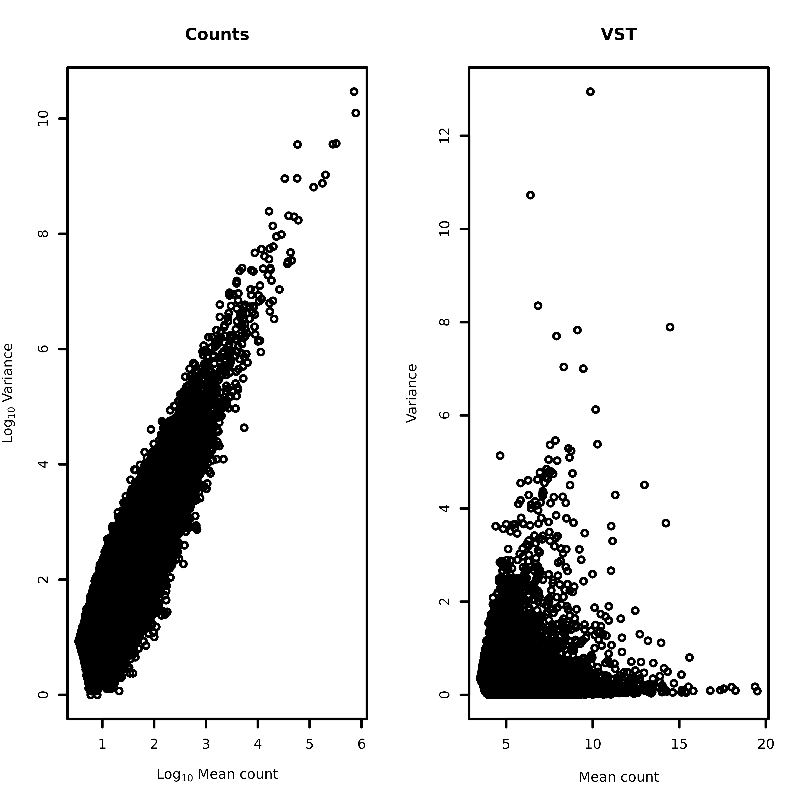
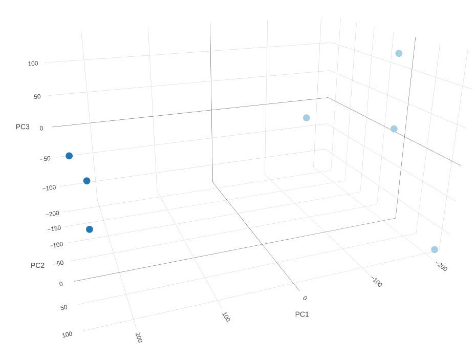
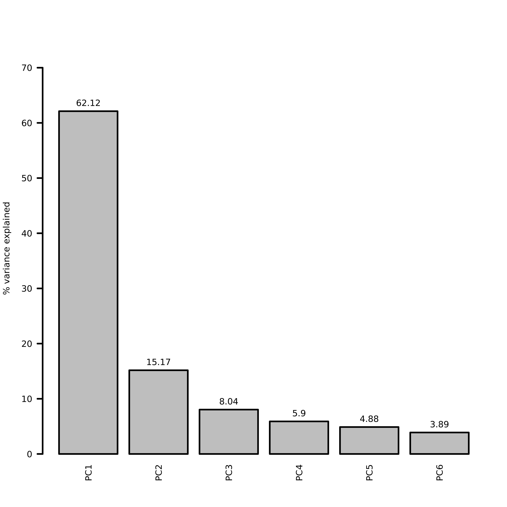
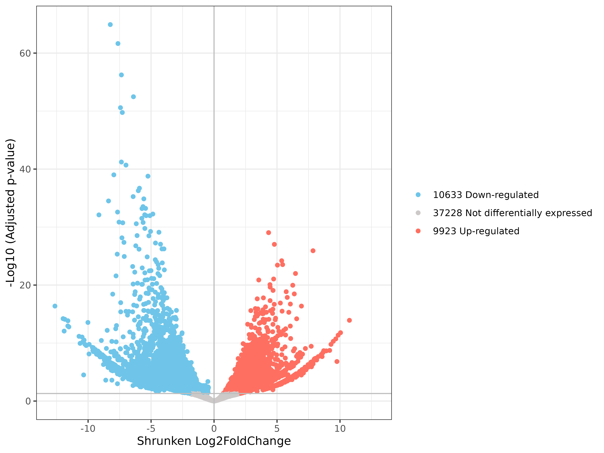
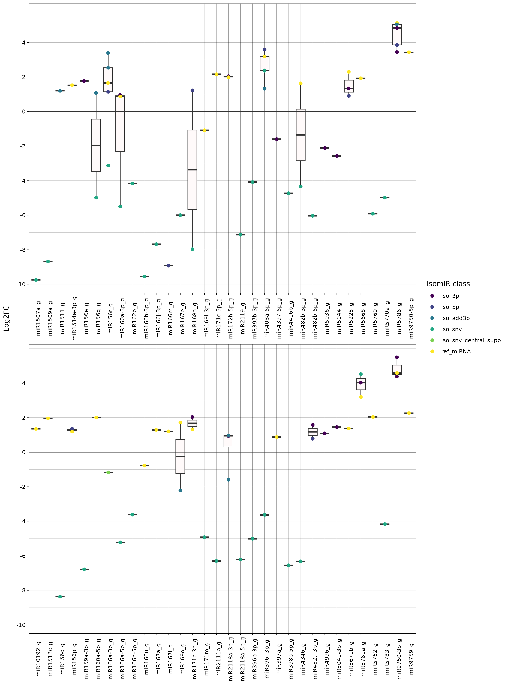
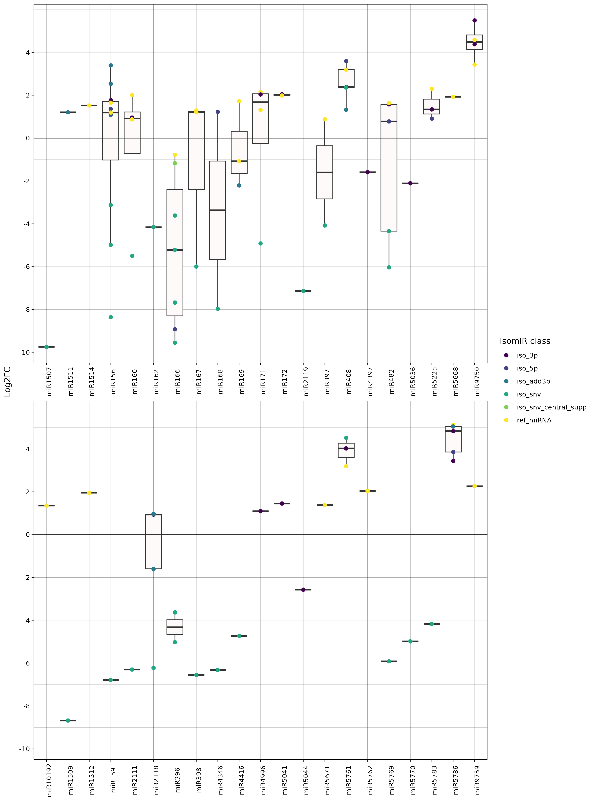

# Output

## Introduction

This document describes the structure and content of the output produced by miRdeX-nf. The pipeline output is organized to mirror the logical progression of the analysis, allowing each result to be traced back to the step that generated it.

```plaintext
outdir/
├── 00-Data_download                  ## Raw FASTQ files downloaded from SRA or provided locally
├── 01-Trimming                       ## Adapter- and quality-trimmed reads after preprocessing
├── 02-QC                             ## Quality control results for raw and trimmed libraries
│    ├── 01-Raw                       ## QC results for unprocessed (raw) reads
│    │    ├── 01-FastQC               ## Per-library FastQC reports (raw reads)
│    │    └── 02-MultiQC              ## Aggregated MultiQC summary for raw reads
│    └── 02-Trimmed                   ## QC results for trimmed reads
│         ├── 01-FastQC               ## Per-library FastQC reports (trimmed reads)
│         └── 02-MultiQC              ## Aggregated MultiQC summary for trimmed reads
├── 03-Validation                     ## Analysis group validation results
├── 04-Filtering                      ## Removal of unwanted sequences and non-target species reads
│    ├── 01-Database_filtering        ## Reads removed by alignment to unwanted sequence databases
│    └── 02-Genome_filtering          ## Reads retained/removed based on reference genome alignment
├── 05-Quantification                 ## Sequence abundance estimation per library and per group
│    ├── 01-Counts_per_sample         ## Raw/RPM counts for each unique sequence in each library
│    ├── 02-Counts_matrix             ## Raw/RPM count matrices for each analysis group
│    └── 03-Samplesheet               ## Auto-generated input sheets to resume workflow from quantification
├── 06-DEA                            ## Differential expression analysis outputs
│    ├── 01-Exploratory_analysis      ## PCA, clustering, variance profiling, and outlier detection
│    └── 02-DESeq2                    ## DESeq2 statistical results and diagnostic plots
├── 07-Annotation                     ## miRNA/isomiR identification and annotation outputs
│    ├── 01-BLAST                     ## BLASTn alignments to reference miRNA databases
│    ├── 02-miRNA_isomiR_annotation   ## Preliminary per-library miRNA/isomiR annotations
│    └── 03-DEA_annotation            ## Fully annotated DEA results (significant sequences)
├── 08-Global_matrices                ## Global miRNA family expression matrices and mapping files
└── 09-Workflow_report                ## Workflow execution reports, logs, and consolidated summaries
```

## Data download
The data download stage retrieves raw sequencing data from the NCBI Sequence Read Archive (SRA) using two utilities from the [SRA Toolkit](https://github.com/ncbi/sra-tools): **prefetch** and **fasterq-dump**.
Prefetch downloads the SRA run files (.sra) corresponding to accession numbers provided in the project metadata. It validates file integrity by checking checksums after transfer. Fasterq-dump then converts the downloaded .sra files into FASTQ format, supporting multi-threaded execution for improved performance. The output FASTQ files are compressed for storage efficiency and serve as the primary input for downstream quality control and preprocessing.

#### Output files

This step produces one compressed FASTQ file per sequencing library for single-end data.

Directory structure:

```plaintext
outdir/
├── 00-Data_download/<SPECIES>/<PROJECT>/
│   └── *.fastq.gz
├── 01-Trimming
├── 02-QC
├── 03-Validation
├── 04-Filtering
├── 05-Quantification
├── 06-DEA
├── 07-Annotation
├── 08-Global_matrices
└── 09-Workflow_report
```

File description:

- `*.fastq.gz` — Raw sequencing reads in standard FASTQ format, compressed with gzip. Each file contains all reads for a given library. These files are the direct input for the Quality Control (QC) step.


## Trimming

<div className="justified">
**Trimming** is the process of removing unwanted sequence elements and low-quality regions from raw sequencing reads. This includes the removal of adapter sequences introduced during library preparation, trimming of low-quality bases from read ends, and the exclusion of reads that fall below a defined minimum length. By eliminating these artifacts, trimming enhances both read quality and mapping performance in later stages of the pipeline.
</div>

### fastp

The trimming step is implemented using [fastp](https://github.com/OpenGene/fastp), a high-performance, all-in-one FASTQ preprocessor written in C++ with full multithreading support. fastp automatically detects and removes adapter sequences, trims low-quality bases from the ends of reads, and discards any reads shorter than the user-defined minimum length (`--min_read_length`). This ensures that only high-quality reads are passed to downstream steps.

#### Output files

This step produces one compressed FASTQ file per library containing the adapter- and quality-trimmed reads that will be used in subsequent analyses.

Directory structure:

```plaintext
outdir/
├── 00-Data_download
├── 01-Trimming/<SPECIES>/<PROJECT>/
│   └── *.fastp.fastq.gz
├── 02-QC
├── 03-Validation
├── 04-Filtering
├── 05-Quantification
├── 06-DEA
├── 07-Annotation
├── 08-Global_matrices
└── 09-Workflow_report
```

File description:

- `*.fastp.fastq.gz` — Compressed FASTQ file containing reads after adapter and quality trimming. Each entry retains the original sequence identifier but with bases at the ends removed according to quality thresholds and adapter detection. Reads shorter than the minimum length are excluded from this file.

```plaintext
@SEQ_ID_1
TGACAGAAGAGAGTGAGCAC
+
IIIIIIIIIIIIIIIIIIII
@SEQ_ID_2
TGAAGCTGCCAGCATGATCTA
+
IIIIIIIIIIIIIIIIIIII
...
```


## Quality control (QC)

The **quality control (QC)** stage evaluates sequencing read quality both before and after trimming. QC is performed with FastQC for per-library assessments and MultiQC for aggregated project-level summaries.

### FastQC
The quality assessment of **individual libraries** is performed using [FastQC](https://www.bioinformatics.babraham.ac.uk/projects/fastqc/). FastQC runs a series of diagnostic checks on raw and trimmed reads, including per-base sequence quality, GC content, sequence length distribution, overrepresented sequences, and adapter contamination. Running FastQC on both pre- and post-trimmed datasets allows direct comparison to verify sequencing quality and to assess the effectiveness of the trimming process.

#### Output files
This step produces one HTML report and one compressed archive per library, both containing the results of all FastQC quality metrics.

Directory structure:

```plaintext
outdir/
├── 00-Data_download
├── 01-Trimming
├── 02-QC
│    ├── 01-FastQC/<SPECIES>/<PROJECT>/
│    │    ├── *.fastqc.html
│    │    └── *.fastqc.zip
│    └── 02-MultiQC
├── 03-Validation
├── 04-Filtering
├── 05-Quantification
├── 06-DEA
├── 07-Annotation
├── 08-Global_matrices
└── 09-Workflow_report
```

File description:

- `*.fastqc.html` — Interactive HTML report containing plots and tables for all FastQC quality checks, viewable in any web browser.
- `*.fastqc.zip` — Compressed directory containing the raw data and images from the FastQC analysis, including the fastqc_data.txt file with all numerical metrics.

### MultiQC

[MultiQC](https://multiqc.info/) compiles all individual FastQC reports into a single aggregated HTML report. This global summary provides an at-a-glance overview of sequencing quality across all libraries, enabling rapid detection of systematic issues, batch effects, or quality trends that might affect downstream analyses.

#### Output files

MultiQC generates one interactive HTML report at the **project level**.

Directory structure:

```plaintext
outdir/
├── 00-Data_download
├── 01-Trimming
├── 02-QC
│    ├── 01-FastQC
│    └── 02-MultiQC/<SPECIES>/<PROJECT>/
│         └── *_report.html
├── 03-Validation
├── 04-Filtering
├── 05-Quantification
├── 06-DEA
├── 07-Annotation
├── 08-Global_matrices
└── 09-Workflow_report
```

File description:

- `*_report.html` — Aggregated, interactive HTML report combining all individual FastQC outputs. Includes side-by-side comparisons of quality metrics, summary tables, and plots across all libraries in the project.

## Validation

The **validation** stage verifies that datasets meet minimum quality and replication standards before proceeding to Differential Expression Analysis (DEA). This step ensures that downstream statistical analyses are based on sufficiently deep and adequately replicated datasets. Two distinct validation modes are implemented depending on the input type: **Library validation** and **Count matrix validation**. In both modes, validation operates at the analysis group level, ensuring that all sample groups to be compared in DEA satisfy the thresholds specified by the user.

### Library validation (*Option 1*)

The **library validation** step evaluates the suitability of both individual libraries and their corresponding analysis groups for inclusion in downstream analyses. Two independent criteria are applied: the **sequencing depth** of each library and the **minimum number of biological replicates** per sample group within an analysis group. These thresholds are defined by the user via the `--validation_depth` and `--validation_rep` parameters, respectively.

Validation ensures that only analysis groups meeting both criteria — sufficient sequencing depth in all relevant libraries and adequate replication in all compared sample groups — are carried forward into DEA.

#### Output files
This step produces two tab-delimited reports — one detailing library-level validation (depth and replicates) and another summarizing analysis group validity based on these criteria. Libraries or groups failing validation are excluded from subsequent steps.

Directory structure:

```plaintext
outdir/
├── 00-Data_download
├── 01-Trimming
├── 02-QC
├── 03-Validation/<SPECIES>/<PROJECT>/
│    ├── *sum_libraries.tsv
│    └── *sum_project.tsv
├── 04-Filtering
├── 05-Quantification
├── 06-DEA
├── 07-Annotation
├── 08-Global_matrices
└── 09-Workflow_report
```

File description:

- `*sum_libraries.tsv` — Lists each processed library with its validation status. Columns:
  - `File` — Library identifier (matches the Run column in the metadata).
  - `Depth` — Total number of reads in the library.
  - `Depth_validity` — `valid` if the library meets the minimum depth threshold, `not-valid` otherwise.
  - `Replicates_validity` — `valid` if the library belongs to a sample group with at least the required number of biological replicates, and the other group in the planned DEA comparison also meets this requirement; `not-valid` otherwise.

```plaintext
File	Depth	Depth_validity	Replicates_validity
SRR14182731.fastp.fastq.gz	19042524	valid	valid
SRR14182732.fastp.fastq.gz	12561071	valid	valid
SRR14182733.fastp.fastq.gz	18047262	valid	valid
SRR14182734.fastp.fastq.gz	14794553	valid	valid
SRR14182735.fastp.fastq.gz	16977623	valid	valid
SRR14182736.fastp.fastq.gz	18485787	valid	valid
SRR14182738.fastp.fastq.gz	17822264	valid	valid
SRR14182739.fastp.fastq.gz	12127819	valid	valid
SRR14182740.fastp.fastq.gz	11545483	valid	valid
SRR14182741.fastp.fastq.gz	6659745	valid	valid
SRR14182742.fastp.fastq.gz	8379530	valid	valid
SRR14182743.fastp.fastq.gz	16865976	valid	valid
SRR14182747.fastp.fastq.gz	16022716	valid	valid
SRR14182749.fastp.fastq.gz	17600922	valid	valid
SRR14182750.fastp.fastq.gz	15849560	valid	valid
```

- `*sum_project.tsv` — Aggregates validation results across libraries within each analysis group. Columns:
  - `Project` — Project identifier (Project column in the metadata).
  - `Group_id` — Analysis group identifier (Group column in the metadata).
  - `Number_valid_files` — Number of libraries passing both depth and replicate requirements.
  - `Number_not_valid_files` — Number of libraries failing one or both requirements.
  - `Group_validity` — `valid` if the analysis group contains at least two sample groups meeting the minimum replicate threshold and sequencing depth requirement; `not-valid` otherwise.

```plaintext
Project	Group_id	Number_valid_files	Number_not_valid_files	Group_validity
PROJECT1	1	2	4	not-valid
PROJECT1	2	0	6	not-valid
PROJECT1	3	1	5	not-valid
PROJECT1	4	0	6	not-valid
PROJECT1	5	3	3	not-valid
PROJECT1	6	6	0	valid
PROJECT1	7	6	0	valid
PROJECT1	8	6	0	valid
PROJECT1	9	6	0	valid
```

### Count matrix validation (*Option 2*)

The **count matrix validation** step is applied when the input provided in the samplesheet is a precomputed count matrix for a specific analysis group (`--from_counts`) rather than raw sequencing libraries. In this scenario, sequencing depth is not applicable, and validation instead considers two main aspects. First, the **structural integrity** of the matrix is checked to ensure that the file follows the expected format, including correct column names and appropriate data types. Second, the **number of biological replicates** in each sample group intended for DEA is verified against the user-defined threshold (`--validation_rep`). An analysis group passes validation only if the matrix structure is correct and all sample groups satisfy the replicate requirement, and any group failing either criterion is excluded from DEA.


#### Output files
This step produces two tab-delimited reports — one detailing library-level validation (depth and replicates) and another summarizing analysis group validity based on these criteria. Libraries or groups failing validation are excluded from subsequent steps.

Directory structure:

```plaintext
outdir/
├── 00-Data_download
├── 01-Trimming
├── 02-QC
├── 03-Validation/<SPECIES>/<PROJECT>/
│    └── *sum.tsv
├── 04-Filtering
├── 05-Quantification
├── 06-DEA
├── 07-Annotation
├── 08-Global_matrices
└── 09-Workflow_report
```

File description:

- `*sum.tsv` — Aggregates validation results across libraries within each analysis group. Columns:
  - `Group` — Full analysis group identifier formed by concatenating the project identifier and the group_id.
  - `Project` — Project identifier (`Project` column in the metadata).
  - `Group_id` — Analysis group identifier (`Group` column in the metadata).
  - `Group_validity` — Indicates whether the group meets the validation criteria (`valid`) or fails (`not-valid`).
  - `Exclusion_reason` — Specifies the reason why a group is marked as `not-valid` (`NA` if the group is `valid`).
  - `Number_valid_samples` — Number of samples passing both depth and replicate requirements.
  - `Number_not_valid_samples` — Number of samples failing one or both requirements.

```
Group	Project	Group_id	Group_validity	Exclusion_reason	Number_valid_samples	Number_not_valid_samples
PROJECT1_1	PROJECT1	1	not-valid	replicates	2	4
```

## Filtering

The **filtering** stage aims to remove undesired sequences and retain only those relevant for downstream analysis, using [Bowtie](https://bowtie-bio.sourceforge.net/manual.shtml) — an ultrafast, memory-efficient short-read aligner that leverages the Burrows–Wheeler index to minimize memory usage while maintaining high mapping speed. In miRdeX-nf, Bowtie runs in single-end mode and supports full multi-threading, enabling the rapid alignment of millions of small RNA reads. This step can be applied in two modes: **Database** and **Genome** filtering.

Both modes produce, for each library, an alignment summary file along with compressed FASTQ files containing reads classified as either aligned (retained or discarded, depending on the mode) or unaligned. Additional Bowtie parameters can be passed using `--bowtie_filt_db_ext_args` or `--bowtie_filt_genome_ext_args`.


### Database filtering

In this mode, reads are aligned against a user-defined reference sequence **database** specified with `--filt_db /path/to/database.fasta`. The database typically contains unwanted sequences such as rRNA, tRNA, snRNA, snoRNA, etc. Reads mapping to this database are discarded, and only the unaligned reads are passed to downstream analysis. Additional alignment parameters for Bowtie can be provided via `--bowtie_filt_db_ext_args`.

#### Output files

This *optional* step generates, for each library, an alignment report and two FASTQ files containing reads classified as **aligned** (discarded) or **unaligned** (retained for further analysis).

```plaintext
outdir/
├── 00-Data_download
├── 01-Trimming
├── 02-QC
├── 03-Validation
├── 04-Filtering
│    ├── 01-Database_filtering/<SPECIES>/<PROJECT>/
│    │    ├── 01-Alignment_out/
│    │    │    └── *.out
│    │    └── 02-Libraries/
│    │         ├── *.database.aligned.fastq.gz
│    │         └── *.database.unaligned.fastq.gz
│    └── 02-Genome_filtering/
├── 05-Quantification
├── 06-DEA
├── 07-Annotation
├── 08-Global_matrices
└── 09-Workflow_report
```

File description:

- `01-Alignment_out/*.out` — Alignment summary generated by Bowtie for each library, reporting total reads processed, number and percentage of reads aligned, and other alignment statistics.

```plaintext
## reads processed: 8754320
## reads with at least one alignment: 201614 (2.30%)
## reads that failed to align: 8552706 (97.70%)
Reported 201614 alignments
```

- `02-Libraries/*.database.aligned.fastq.gz` — Compressed FASTQ file containing reads that aligned to the filtering database (discarded in downstream analysis).

```plaintext
@SEQ_ID_1
TGACAGAAGAGAGTGAGCAC
+
IIIIIIIIIIIIIIIIIIII
@SEQ_ID_2
TGAAGCTGCCAGCATGATCTA
+
IIIIIIIIIIIIIIIIIIII
...
```

- `02-Libraries/*.database.unaligned.fastq.gz` — Compressed FASTQ file containing reads that did not align to the database (retained for downstream analysis).

```plaintext
@SEQ_ID_3
TTGACAGAAGATAGAGAGCAC
+
IIIIIIIIIIIIIIIIIIII
@SEQ_ID_4
TGACAGAAGAGAGTGAGCAC
+
IIIIIIIIIIIIIIIIIIII
...
```

### Genome filtering

In this mode, reads are aligned to the reference **genome** specified in the Genome column of the samplesheet when `--filt_genome` is enabled. Reads mapping to the genome are retained, while unaligned reads are discarded, ensuring that only sequences originating from the target species proceed to downstream steps. Additional Bowtie parameters can be provided via `--bowtie_filt_genome_ext_args`.

#### Output files
This *optional* step produces an alignment summary and two FASTQ files per library, containing reads classified as **aligned** (retained) or **unaligned** (discarded).

Directory structure:

```plaintext
outdir/
├── 00-Data_download
├── 01-Trimming
├── 02-QC
├── 03-Validation
├── 04-Filtering
│    ├── 01-Database_filtering
│    └── 02-Genome_filtering/<SPECIES>/<PROJECT>/
│         ├── 01-Alignment_out/
│         │    └── *.out
│         └── 02-Libraries/
│              ├── *.genome.aligned.fastq.gz
│              └── *.genome.unaligned.fastq.gz
├── 05-Quantification
├── 06-DEA
├── 07-Annotation
├── 08-Global_matrices
└── 09-Workflow_report
```

File description:

- `01-Alignment_out/*.out` — Alignment summary from Bowtie for each library, detailing processed reads, number and percentage aligned, and additional statistics.

```plaintext
## reads processed: 8754320
## reads with at least one alignment: 201614 (2.30%)
## reads that failed to align: 8552706 (97.70%)
Reported 201614 alignments
```

- `02-Libraries/*.genome.aligned.fastq.gz` — Compressed FASTQ file containing reads that aligned to the genome (retained in downstream analysis).


```plaintext
@SEQ_ID_4
TGACAGAAGAGAGTGAGCAC
+
IIIIIIIIIIIIIIIIIIII
@SEQ_ID_5
TTGACAGATTATAGAGAGCAC
+
IIIIIIIIIIIIIIIIIIII
...
```

- `02-Libraries/*.genome.unaligned.fastq.gz` — Compressed FASTQ file containing reads that did not align to the genome (discarded in downstream analysis).

```plaintext
@SEQ_ID_3
TTGACAGAAGATAGAGAGCAC
+
IIIIIIIIIIIIIIIIIIII
@SEQ_ID_7
TGACAGTTGAGAGTGAGCAC
+
IIIIIIIIIIIIIIIIIIII
...
```

## Quantification

The quantification step measures the abundance of each unique small RNA sequence detected in the dataset and structures this information for downstream Differential Expression Analysis (DEA). It produces two main outputs: **per-library read counts**, which provide absolute or normalized counts for each sequence in individual libraries, and **analysis group-specific count matrices**, which combine counts from multiple samples belonging to the same analysis group.

### Per-library sequence quantification

For each library, the pipeline quantifies the **abundance of every unique sequence** present in the preprocessed reads. This is achieved by counting the number of times each sequence occurs, producing raw counts that represent the absolute sequencing depth for that sequence within the library. Optionally, counts can be expressed as **Reads Per Million (RPM)**, where counts are scaled by the total number of reads in the library. Raw counts are always generated for downstream DEA, while RPM values are only produced if explicitly requested.

#### Output files

This step produces **one file per library** containing the abundance values for every detected sequence.

Directory structure:

```plaintext
outdir/
├── 00-Data_download
├── 01-Trimming
├── 02-QC
├── 03-Validation
├── 04-Filtering
├── 05-Quantification
│    ├── 01-Counts_per_sample
│    │    ├── 01-Raw/<SPECIES>/<PROJECT>/
│    │    │    └── *.raw.tsv
│    │    └── 02-RPM/<SPECIES>/<PROJECT>/
│    │         └── *.rpm.tsv
│    ├── 02-Counts_matrix
│    └── 03-Samplesheet
├── 06-DEA
├── 07-Annotation
├── 08-Global_matrices
└── 09-Workflow_report
```

File description:

- `01-Raw/<SPECIES>/<PROJECT>/*.raw.tsv` — Table reporting the **raw read counts** for all sequences detected in a single library. The first column (`seq`) contains the nucleotide sequence of the small RNA, while the second column (`raw`) provides the corresponding raw counts.

```plaintext
seq	raw
TTGACAGAAGATAGAGAGCAC	1555213
TGACAGAAGAGAGTGAGCAC	1034539
TGAAGCTGCCAGCATGATCTA	708522
...
```

- `02-RPM/<SPECIES>/<PROJECT>/*.rpm.tsv` — Table reporting the **Reads Per Million (RPM)** for all sequences in a single library (*optional*). The first column (`seq`) contains the nucleotide sequence, and the second column (`RPM`) gives the abundance value after normalization to the total number of mapped reads in that library.

```plaintext
seq	RPM
TTGACAGAAGATAGAGAGCAC	177503.45
TGACAGAAGAGAGTGAGCAC	118076.98
TGAAGCTGCCAGCATGATCTA	80845.67
...
```

### Count matrix construction

For each **analysis group** defined in the metadata file (`Group` column), the pipeline merges the counts from all libraries belonging to that group into a single matrix. An analysis group represents a set of samples analyzed together in a single DEA, typically containing at least two distinct experimental conditions (e.g., Control vs Treatment, Wild-type vs Mutant).

This grouping strategy enables the pipeline to handle multi-project or multi-condition datasets efficiently, generating separate matrices for each group and ensuring that comparisons are performed only between biologically relevant samples. Raw count matrices are required for DEA, while RPM matrices are optional and intended for visualization or exploratory analyses outside DEA.

#### Output files

This step produces **one matrix per analysis group**, with either absolute counts or RPM-normalized counts for all samples in that group. Each matrix is a tab-delimited file where rows correspond to unique sequences and columns correspond to individual samples within the analysis group.

Directory structure:

```plaintext
outdir/
├── 00-Data_download
├── 01-Trimming
├── 02-QC
├── 03-Validation
├── 04-Filtering
├── 05-Quantification
│    ├── 01-Counts_per_sample
│    ├── 02-Counts_matrix
│    │    ├── 01-Raw/<SPECIES>/<PROJECT>/
│    │    │    └── *.raw.tsv
│    │    └── 02-RPM/<SPECIES>/<PROJECT>/
│    │         └── *.rpm.tsv
│    └── 03-Samplesheet
├── 06-DEA
├── 07-Annotation
├── 08-Global_matrices
└── 09-Workflow_report
```

File description:

- `01-Raw/<SPECIES>/<PROJECT>/*.raw.tsv` — **Raw count matrix** for all samples in the analysis group. The first column (`seq`) contains the nucleotide sequence, and each subsequent column corresponds to a sample in the group, reporting the raw count for that sequence. Sample column names correspond to the `Run` identifiers in the metadata.
  
```plaintext
seq	SRR1848791	SRR1848792	SRR1848793
TGAAGCTGCCAGCATGATCTA	881696	793949	1008586
TTGACAGAAGATAGAGAGCAC	834634	780906	1046367
TGACAGAAGAGAGTGAGCAC	326492	373550	513835
...
```

- `02-RPM/<SPECIES>/<PROJECT>/*.rpm.tsv` — **RPM-normalized count matrix** for all samples in the analysis group (*optional*). The first column (`seq`) contains the nucleotide sequence, and each subsequent column corresponds to a sample in the group, reporting the normalized abundance to the total mapped reads of that sample. Sample column names correspond to the `Run` identifiers in the metadata.

```plaintext
seq	SRR1848791	SRR1848792	SRR1848793
TGAAGCTGCCAGCATGATCTA	100512.67	94587.21	112345.88
TTGACAGAAGATAGAGAGCAC	95123.44	92987.53	116223.56
TGACAGAAGAGAGTGAGCAC	37219.88	44410.56	57012.31
...
```

### Samplesheet generation (*optional*)

In addition to the count matrices, the pipeline can optionally generate a **samplesheet at the quantification stage**. This file follows the same format as the standard pipeline input samplesheet and contains metadata entries for each analysis group, along with the file paths to the corresponding **raw count matrices**.
This functionality is designed to allow the workflow to be resumed directly from the quantification stage in a future run, without repeating earlier steps such as data download, trimming, filtering, or quality control. It is particularly useful when the first part of the pipeline is executed separately—e.g., to preprocess and quantify sequencing data—while deferring DEA and annotation to a later execution.

#### Output files

One samplesheet file is generated per project, located under 05-Quantification/03-Samplesheet/.

Directory structure:

```plaintext
outdir/
├── 00-Data_download
├── 01-Trimming
├── 02-QC
├── 03-Validation
├── 04-Filtering
├── 05-Quantification
│    ├── 01-Counts_per_sample
│    ├── 02-Counts_matrix
│    └── 03-Samplesheet
│         └── samplesheet_counts.tsv
├── 06-DEA
├── 07-Annotation
├── 08-Global_matrices
└── 09-Workflow_report
```

File description:

- `samplesheet_counts.tsv` — Tab-delimited file containing one row per count matrix generated during quantification. It is composed of five columns:
  - `Id` — Project identifier associated with the generated count matrix.
  - `File` — Path to the count matrix file stored within the output directory.
  - `Metadata` — Path to the metadata file specified for this project in the samplesheet used during the previous pipeline execution.
  - `Genome` — Path to the genome file of the species associated with this project, if it was provided in the previous execution’s samplesheet; otherwise, this field remains empty.
  - `Group` — Group identifier (`Group_id`) corresponding to the analysis group to which the generated count matrix belongs.

```plaintext
Id	File	Metadata	Genome	Group
PROJECT1	/path/to/PROJECT1_6.raw.tsv	/path/to/metadata.tsv	/path/to/genome.fa	6
...
```

## Differential expression analysis (DEA)

Differential expression analysis (DEA) is performed with [DESeq2](https://bioconductor.org/packages/release/bioc/html/DESeq2.html), a statistical framework that models count data using negative binomial distributions, estimates size factors and dispersion parameters, and applies shrinkage methods to improve log2 fold-change (log2FC) estimation. For each analysis group defined in the metadata (`Group` column), the pipeline performs two main stages: **Exploratory Analysis** and **Statistical Testing**.

### Exploratory analysis (EA)

The exploratory analysis phase provides an initial assessment of the dataset before formal statistical testing. Its primary goals are to identify potential outliers, evaluate variance patterns, and determine whether samples cluster according to their biological conditions. This early insight is crucial for detecting technical artifacts, batch effects, or weak separation between experimental groups, allowing users to make informed decisions about data quality and downstream analysis.

#### Output files

For each analysis group, the pipeline generates a set of exploratory visualizations and summary tables that describe variance structure and sample relationships. These include mean–variance plots (raw and VST-transformed data), interactive and static PCA plots, and an optional clustering significance test.

Directory structure:

```plaintext
outdir/
├── 00-Data_download
├── 01-Trimming
├── 02-QC
├── 03-Validation
├── 04-Filtering
├── 05-Quantification
├── 06-DEA/<SPECIES>/<PROJECT>/<PROJECT>_<GROUP>/
│    ├── 01-Exploratory_analysis
│    │    ├── 01-PCA/
│    │    ├── 02-Mean_vs_variance/
│    │    └── *.ea_summary.tsv
│    └── 02-DESeq2
├── 07-Annotation
├── 08-Global_matrices
└── 09-Workflow_report
```

File description:
- **Mean–variance plot** — Before performing Principal Component Analysis (PCA), the pipeline automatically computes the relationship between mean abundance and variance across features, both on raw counts and on counts transformed using the **Variance Stabilizing Transformation (VST)**. This transformation, applied exclusively for exploratory purposes, stabilizes variance across the dynamic range of counts, preventing highly abundant sequences from dominating the analysis. The VST-transformed data are then used as input for PCA.



- **Principal Component Analysis (PCA)** — A dimensionality-reduction technique that projects high-dimensional expression data onto a small number of orthogonal axes (principal components) that explain most of the variance in the dataset. In this context, PCA helps to:
  - Identify whether samples cluster according to their experimental conditions.
  - Detect batch effects or outlier samples.
  
  *Clustering test (Optional)*: After computing the PCA, the coordinates of each sample on the first three principal components are used to calculate pairwise Euclidean distances between samples. Two sets of distances are then compared:
    - **Intra-condition distances** – distances between samples belonging to the same experimental condition (e.g., control vs control).
    - **Inter-condition distances** – distances between samples from different experimental conditions (e.g., control vs treated).
  
  A **Mann–Whitney–Wilcoxon (MWW) test** is applied to assess whether intra-condition distances are significantly smaller than inter-condition distances, which would indicate that samples cluster more tightly within their respective conditions than between them. The significance threshold for this test is defined via `--ea_p_value`. Groups failing this test (p-value above threshold) may indicate weak separation between conditions, potentially due to biological similarity, low statistical power, or technical artifacts. **Such information can be used to decide whether a given analysis group should be retained for downstream steps**.

  Three PCA outputs are generated:
  - `*.ea.html` — An interactive 3D **PCA plot** (Plotly) for dynamic inspection.
  
  

  - `*variance.ea.png` — A **variance bar plot** showing the percentage of total variance explained by each component.
  
  
  
  - `*.ea_summary.tsv` — **Summary** statistics from the EA stage, including proportion of variance explained by the top principal components and the p-value from the Mann–Whitney–Wilcoxon test (Clustering test). Example:

```plaintext
Group_id	Group	PC1	PC2	PC3	PC4	PC5	PC6	P-value(MWW)
1	PRJNA277424_1	33.57	23.91	16.85	13	12.67	0	0.327672327672328
```

### DESeq2

The statistical testing phase uses DESeq2 to identify sequences with significant differences in expression between experimental conditions within each analysis group. Two statistical testing methods are supported:
- **Wald test (default)** – Evaluates whether the estimated log2FC between two conditions differs significantly from zero (or from a user-defined threshold if `--log2FC_threshold` is set).
- **Likelihood Ratio Test (LRT)** – Compares a full model to a reduced (nested) model, useful for detecting features with any change across multiple conditions.
  
**Significance** is determined using two user-configurable thresholds:

- **Alpha** — Controlled via the `--dea_alpha` (default: `0.05`) option. This parameter not only defines the statistical significance cut-off but is also used by DESeq2 to optimize independent filtering (default in DESeq2: 0.1).
- **log2FC threshold** — Defined by the `--log2FC_threshold` (default: `0`) option. This threshold modifies the null hypothesis of the Wald test from **“log2FC equals zero” to “absolute log2FC equals the specified threshold”**, making the test more conservative than post-hoc filtering and typically yielding fewer significant sequences. When this threshold is set, Wald tests are used and any LRT p-values are replaced accordingly.
  
Both thresholds are applied directly within DESeq2’s `results()` function, ensuring that statistical significance and effect size filtering are integrated into the statistical testing itself rather than applied as a separate downstream filter.

#### Output files

For each analysis group, DESeq2 produces a complete set of statistical results summarizing the expression changes for every tested sequence. These results are saved in two complementary tables: one containing the full output of the statistical testing, and another containing only the sequences that meet the significance criteria defined by the user.

Directory structure:

```plaintext
outdir/
├── 00-Data_download
├── 01-Trimming
├── 02-QC
├── 03-Validation
├── 04-Filtering
├── 05-Quantification
├── 06-DEA/<SPECIES>/<PROJECT>/<PROJECT>_<GROUP>/
│    ├── 01-Exploratory_analysis
│    └── 02-DESeq2
│         ├── *.dea_raw.tsv
│         ├── *.dea_sig.tsv
│         └── *.dea_summary.tsv
├── 07-Annotation
├── 08-Global_matrices
└── 09-Workflow_report
```

File description:

- `*.dea_raw.tsv` — Contains **all sequences tested** in the DEA, regardless of significance. Columns include:
  - seq: nucleotide sequence identifier.
  - baseMean: average normalized count across all samples.
  - log2FoldChange, lfcSE: estimated fold-change and its standard error.
  - stat, pvalue, padj: test statistic, nominal p-value, and Benjamini–Hochberg adjusted p-value.
  - Shrunkenlog2FoldChange, ShrunkenlfcSE: fold-change estimates after shrinkage, which can improve interpretability for low-count sequences.

```plaintext
seq	baseMean	log2FoldChange	lfcSE	stat	pvalue	padj	Shrunkenlog2FoldChange	ShrunkenlfcSE
TGAAGCTGCCAGCATGATCTA	803236.367418382	-0.583076436382874	0.258471157132313	-2.25586654562154	0.0240789902327954	0.672101711910244	-0.104952659462252	0.176958098516965
TTGACAGAAGATAGAGAGCAC	863723.458954856	-0.317135465478088	0.258671697273475	-1.22601532684422	0.220192907367621	0.999975255063918	-0.0416546207753741	0.101953208650155
...
```

- `*.dea_sig.tsv` — A subset of the raw table containing only sequences classified as **significantly differentially expressed** according to the thresholds set by `--dea_alpha` and `--log2FC_threshold`. This prefiltered table is the direct input for downstream steps of the pipeline.

```plaintext
seq	baseMean	log2FoldChange	lfcSE	stat	pvalue	padj	Shrunkenlog2FoldChange	ShrunkenlfcSE
TGGAGAAGCAGGGCACGTGCG	5270.59462040738	-1.33897817298659	0.312639650974803	-4.28281623527819	1.84542578517607e-05	0.00273032257560886	-1.17324879157415	0.336930141747823
GCTCTCTAGCCTTCTGTCATC	5233.09932720146	-0.999614201204017	0.280632852960409	-3.56199992502318	0.000368040489264889	0.0303801714842892	-0.810095249983538	0.319443489924416
...
```

- `*.volcano.png` — **Volcano plot** of log2FC vs –log10 adjusted p-value, highlighting significant DE sequences.



- `*.dea_summary.tsv` — **Summary** of DEA, including number of significant features, total features tested, method used, and sample IDs.

```plaintext
Group	Test	Padj<alpha	Total	Coefficient	Contrast	Contrast_coefficient	Samples
PRJNA277424_1_0	Wald	1133	81225	Level_30._vs_70.	No contrast	No contrast	SRR1848791,SRR1848792,SRR1848793,SRR1848794,SRR1848795,SRR1848796
```

## miRNA/isomiR annotation

In this stage, **canonical microRNAs (miRNAs) and potential isomiRs are identified** from the processed sequencing libraries, after trimming and optional filtering. The process combines sequence similarity searches against curated miRNA reference databases with a subsequent classification and filtering workflow, allowing the distinction between true miRNA variants and sequencing artifacts.

### Reference alignment (BLASTn)

The annotation step begins by aligning sRNA sequences against reference mature and precursor miRNAs from [miRBase](https://mirbase.org), sRNAanno, or [PmiREN](https://www.prmiren.com) using [BLAST (Basic Local Alignment Search Tool)](https://www.ncbi.nlm.nih.gov/books/NBK279690/). BLAST is a widely used sequence comparison algorithm that detects regions of local similarity between sequences and reports detailed alignment metrics, including identity percentage, alignment length, e-value, and bit score. These results enable the precise identification of sequences matching known miRNAs, either partially or in full.

#### Output files

The BLAST alignment step produces a set of output files containing detailed match information for each queried small RNA sequence against mature and precursor miRNA reference databases. Separate result files are generated for alignments to mature sequences, precursor sequences, and a combined table integrating both. Each file includes the query sequence identifier, matched reference ID(s), alignment statistics (identity, alignment length, mismatches, gaps, start/end positions), and standard BLAST metrics such as e-value and bit score. These outputs serve as the foundation for the downstream miRNA/isomiR classification and filtering stages.

Directory structure:

```plaintext
outdir/
├── 00-Data_download
├── 01-Trimming
├── 02-QC
├── 03-Validation
├── 04-Filtering
├── 05-Quantification
├── 06-DEA
├── 07-Annotation
│    ├── 01-BLAST
│    │    │── 01-Mature_miRNA/<SPECIES>/<PROJECT>/
│    │    │    └── *.txt
│    │    │── 02-Precursor_miRNA/<SPECIES>/<PROJECT>/
│    │    │    └── *.txt
│    │    └──03-Mature_and_precursor/<SPECIES>/<PROJECT>/
│    │         └── *.mpblast.tsv
│    ├── 02-miRNA_isomiR_annotation
│    └── 03-DEA_annotation
├── 08-Global_matrices
└── 09-Workflow_report
```

File description:

- `01-Mature_miRNA/<SPECIES>/<PROJECT>/*.txt` — BLAST alignments to mature miRNA sequences. Columns correspond to the standard BLAST tabular output (**outfmt 6**):
  - qseqid – Query sequence identifier (e.g., read ID).
  - sseqid – Subject sequence identifier (mature miRNA name or accession).
  - pident – Percentage of identical matches over the alignment length.
  - length – Alignment length (in nucleotides).
  - mismatch – Number of mismatched bases.
  - gapopen – Number of gap openings.
  - qstart – Start position of the alignment in the query sequence.
  - qend – End position of the alignment in the query sequence.
  - sstart – Start position of the alignment in the subject sequence.
  - send – End position of the alignment in the subject sequence.
  - evalue – Expectation value; probability of obtaining an alignment by chance.
  - bitscore – Alignment bit score; higher scores indicate better alignments.

```plaintext
SRR1848791.9	ath-miR408-5p	100.000	21	0	0	1	21	1	21	1.25e-08	42.1
SRR1848791.10	ath-miR157a-5p|ath-miR157b-5p|ath-miR157c-5p	100.000	21	0	0	1	21	1	21	1.25e-042.1
SRR1848791.10	ath-miR157d	100.000	20	0	0	2	21	1	20	4.93e-08	40.1
...
```

- `02-Precursor_miRNA/<SPECIES>/<PROJECT>/*.txt` — BLAST alignments to precursor miRNA sequences. Same column format as above.

```plaintext
SRR1848791.10676985	ath-miR169a	100.000	13	0	0	5	17	169	181	0.009	26.3
SRR1848791.10677541	ath-miR163	94.737	19	1	0	4	22	182	200	5.98e-04	30.2
SRR1848791.10677625	ath-miR169h	100.000	13	0	0	2	14	112	124	0.009	26.3
...
```

- `03-Mature_and_precursor/<SPECIES>/<PROJECT>/*.mpblast.tsv` — Combined mature and precursor hits, with both mature and precursor reference sequences included in the same row alongside their alignments. The file contains two sets of BLAST output fields (one for the mature hit, one for the precursor hit), plus the aligned sequences themselves:
  - Columns 1-12 – Mature hit columns. Same as the standard BLAST fields above.
  - Column 13 – Query nucleotide sequence aligned to the mature reference.
  - Column 14 – Subject nucleotide sequence from the mature miRNA reference.
  - Columns 15-26 – Precursor hit columns. Same as the standard BLAST fields above, but for the precursor alignment.
  - Column 27 – Query nucleotide sequence aligned to the precursor miRNA reference.
  - Column 28 – Subject nucleotide sequence from the precursor miRNA reference.

```plaintext
SRR1848791.9669	ath-miR156c-3p	ath-miR156c-3p	100.000	22	0	0	1	22	1	22	3.40e-09	44.1	GCTCACTGCTCTATCTGTCAGA	GCTCACTGCTCTATCTGTCAGA	ath-miR156c	ath-miR156c	100.000	22	0	0	1	22	75	96	3.72e-08	44.1	CGCATAGAAACTGACAGAAGAGAGTGAGCACACAAAGGCACTTTGCATGTTCGATGCATTTGCTTCTCTTGCGTGCTCACTGCTCTATCTGTCAGATTCCGGCT
SRR1848791.6936885	ath-miR168a-3p	ath-miR168a-3p	100.000	17	0	0	6	22	1	17	3.51e-06	34.2	TGGATCCCGCCTTGCATCAACTC	CCCGCCTTGCATCAACTGAAT	ath-miR168a	ath-miR168a	100.000	22	0	0	1	22	98	119	3.69e-08	44.1	CACCATCGGGCTCGGATTCGCTTGGTGCAGGTCGGGAACCAATTCGGCTGACACAGCCTCGTGACTTTTAAACCTTTATTGGTTTGTGAGCAGGGATTGGATCCCGCCTTGCATCAACTGAATCGGATCCTCGAGGTG
SRR1848791.3066128	ath-miR156e	ath-miR156a-5p|ath-miR156b-5p|ath-miR156c-5p|ath-miR156d-5p|ath-miR156e|ath-miR156f-5p	100.00020	0	0	2	21	1	20	5.31e-08	40.1	CTGACAGAAGAGAGTGAGCACT	TGACAGAAGAGAGTGAGCAC	ath-miR156e	ath-miR156e	100.000	20	0	0	2	21	7	26	5.80e-07	40.1	AGGAGGTGACAGAAGAGAGTGAGCACACATGGTGGTTTCTTGCATGCTTTTTTGATTAGGGTTTCATGCTTGAAGCTATGTGTGCTTACTCTCTCTCTGTCACCCCT
...
```

### IsomiR filtering and classification

Following the BLAST alignment stage, candidate sequences undergo a refinement and categorization process to distinguish true biological miRNA variants from sequencing artifacts or unrelated small RNAs. This step is essential for ensuring that downstream analyses focus on high-confidence annotations, accurately separating canonical miRNAs from the diverse spectrum of isomiRs.

- **Canonical miRNAs** – sequences with perfect identity to a known mature miRNA.
- **IsomiRs** – variants of canonical miRNAs with sequence differences. IsomiRs are further subtyped:
   - iso_5p:+/-N — Shift in the 5′ end of the sequence.
   - iso_3p:+/-N — Shift in the 3′ end of the sequence.
   - iso_add5p:N — Non-templated nucleotide additions at the 5′ end.
   - iso_add3p:N — Non-templated nucleotide additions at the 3′ end.
   - iso_snv_seed — Substitutions in positions 2–7 (seed region).
   - iso_snv_central — Substitutions in positions 9–12.
   - iso_snv_central_offset — Substitutions in position 8.
   - iso_snv_central_supp — Substitutions in positions 13–17.
   - iso_snv — Substitutions outside the regions above.

All sequences annotated as isomiRs undergo a dedicated filtering stage to ensure that only biologically meaningful variants are retained.
This process consists of two main steps:

- **Genomic alignment for non-templated isomiRs** – Non-templated isomiRs—those whose sequence does not perfectly match the canonical miRNA nor its precursor—are aligned to the organism’s reference genome (via Bowtie). This step identifies and discards variants that may originate from unrelated genomic loci rather than from the annotated miRNA precursor.

- **Abundance filtering (all isomiRs)** – IsomiRs are evaluated for expression level to exclude low-confidence variants likely arising from sequencing noise. The pipeline supports two filtering strategies:
  - **RPM** – Minimum Reads Per Million.
  - **Relative abundance** – Ratio between the RPM of the isomiR and the RPM of its canonical miRNA within the same sample.
  
These thresholds must be met in a minimum number of samples, ensuring that retained isomiRs have consistent and reproducible expression patterns.

#### Output files

This stage produces structured annotation files describing all identified canonical miRNAs and isomiRs for each sample. These annotations include the positions of each sequence relative to its precursor miRNA, the relationship to the canonical miRNA, variant classification, sequence details, and basic expression metrics.

Directory structure:

```plaintext
outdir/
├── 00-Data_download
├── 01-Trimming
├── 02-QC
├── 03-Validation
├── 04-Filtering
├── 05-Quantification
├── 06-DEA
├── 07-Annotation
│    ├── 01-BLAST
│    ├── 02-miRNA_isomiR_annotation/<SPECIES>/<PROJECT>/
│    │    └── *.gff3
│    └── 03-DEA_annotation
├── 08-Global_matrices
└── 09-Workflow_report
```

File description:

- `*.gff3` — Standard GFF3 file containing per-sample annotations for all detected canonical miRNAs and isomiRs. Each entry follows the 9-column GFF3 specification, reporting the sequence identifier, annotation source, variant type, coordinates relative to the precursor sequence, alignment score, strand, and other core fields. The last field, attributes, stores rich metadata describing sequence identity, relationship to the canonical miRNA, variant classification, expression levels, filtering status, and reference sequences for both mature and precursor forms. Detailed field and attribute descriptions:
  
    1. **seqid**: identifier of the annotated miRNA or isomiR (e.g., ath-miR170-3p).
    2. **source**: database used for annotation (e.g., mirbase).
    3. **type**: annotation type, such as ref_miRNA (canonical) or an isomiR subtype.
    4. **start**: first nucleotide position of the aligned region relative to the precursor sequence (as reported by BLAST).
    5. **end**: last nucleotide position of the aligned region relative to the precursor sequence (as reported by BLAST).
    6. **score**: alignment score (often from BLAST).
    7. **strand**: + or -, relative to the precursor sequence orientation.
    8. **phase**: not used here; represented as ..
    9. **attributes**: semicolon-separated key–value pairs providing additional details.
   
    **Key attributes**
    - **Read**: Observed small RNA sequence in the sample.
    - **UID**: Unique identifier derived from the nucleotide sequence.
    - **Name**: Canonical miRNA name of the aligned sequence.
    - **Parent**: Name of the precursor miRNA.
    - **Variant**: IsomiR variant classification (or None for canonical).
    - **Changes**: Specific sequence changes relative to the canonical miRNA (e.g., additions, deletions, substitutions).
    - **Cigar**: CIGAR string for the alignment (always `None`).
    - **Hits**: Number of database entries matching this sequence.
    - **Expression**: Absolute read counts for the sequence in this sample.
    - **Norm**: Normalized expression (Reads Per Million, RPM).
    - **RelAbundance**: Relative abundance (RPM of isomiR / RPM of its canonical miRNA in the same sample).
    - **Filter**: PASS/REJECT status after abundance filtering.
    - **miRNA_fam**: miRNA family name.
    - **Class**: miRNA class (canonical or specific isomiR type).
    - **miRNA_seq**: Nucleotide sequence of the canonical miRNA.
    - **Parent_seq**: Nucleotide sequence of the precursor miRNA.

```plaintext
### mirGFF3. VERSION 1.2 modified
### source-ontology: mirbase (12-08-2025)
### TOOLS: Blastn
### COLDATA: SRR14182731
gma-miR156i mirbase ref_miRNA 10 30 42.1 + .  Read=TTGACAGAAGATAGAGAGCAC; UID=iso-21-ZDF0H25FD; Name=gma-miR156i; Parent=gma-miR156i; Variant=None; Changes=None;Cigar=None; Hits=1; Expression=238733; Norm=12536.8; RelAbundance=None; Filter=None; miRNA_fam=miR156; Class=ref_miRNA; miRNA_seq=TTGACAGAAGATAGAGAGCAC; Parent_seq=TTAAGGTTGTTGACAGAAGATAGAGAGCACAGATGATGATATGCATATTATATAAAAAGCAGCTAGGGAACTCATGAATTGTGCATCTCACTCCTTTGTGCTCTCTATACTTCTGTCATCACCCTTCAGC
gma-miR166r mirbase isomiR 126 145 40.1 + . Read=TCGGACCAGGCTTCATTCCCAT; UID=iso-22-W2KKN6YRI; Name=gma-miR166r; Parent=gma-miR166r; Variant=iso_add3p:2; Changes=iso_add3p:AT; Cigar=None; Hits=3; Expression=1; Norm=0.052514; RelAbundance=None; Filter=None; miRNA_fam=miR166; Class=undefined; miRNA_seq=TCGGACCAGGCTTCATTCCC; Parent_seq=CACGTCTTGAGGGGAATGCAGTGTGGTCCAAGGAGATGATATATCACTTCACCATACTCATATCTTCACAAACTCATCAGATTCAGATGTAATAATAATTTGTAATATATGCATATTATGTCTCCTCGGACCAGGCTTCATTCCCTTCAATTACA
gma-miR156c mirbase isomiR 146 162 34.2 + . Read=TTGACAGAAGATAGAGATCAC; UID=iso-21-ZDF0H256D; Name=gma-miR156c; Parent=gma-miR156c; Variant=iso_snv; Changes=iso_snv:G18T; Cigar=None; Hits=1; Expression=52; Norm=2.73073; RelAbundance=None; Filter=None; miRNA_fam=miR156; Class=iso_snv; miRNA_seq=TTGACAGAAGATAGAGAGCAC; Parent_seq=ACTTGACCACTAGGCTTATCTCTTTCCGTTTCTGAGCATGCATACTCATTCACAGCATCAAAATGCACAGATCCTGATGGAGATTGCACAGGGCAGGTGATGCTAGATTGCACCATACTCAACTCTGGACTTTGTGATTGAAGTGTTGACAGAAGATAGAGAGCACAACCTGAGTCAAAGGATCC
...
```

### DEA results annotation

This step refines the output of the **differential expression analysis (DEA)** by retaining only those sequences that have been annotated as **canonical miRNAs** or **isomiRs**. It integrates the statistical results from DESeq2 with the detailed annotation metadata, producing enriched result tables that combine expression changes, statistical significance, and biological context. By consolidating DEA and annotation information, this stage facilitates the interpretation of expression patterns in terms of specific miRNAs, isomiR variants, and miRNA families, enabling more targeted biological conclusions.

#### Output files

The files generated in this step combine DEA statistical metrics with annotation details from previous stages, but include **only significantly differentially expressed sequences** annotated as miRNAs or isomiRs. Two main result tables are produced: one containing all matching annotations (including possible multiple matches per sequence) and another with collapsed entries for unique sequences. Additional outputs provide graphical summaries and per-family consistency reports.

Directory structure:

```plaintext
outdir/
├── 00-Data_download
├── 01-Trimming
├── 02-QC
├── 03-Validation
├── 04-Filtering
├── 05-Quantification
├── 06-DEA
├── 07-Annotation
│    ├── 01-BLAST
│    ├── 02-miRNA_isomiR_annotation
│    └── 03-DEA_annotation/<SPECIES>/<PROJECT>/
│         ├── *.all.tsv
│         ├── *.unique.tsv
│         ├── *.boxplot_name.png
│         ├── *.boxplot_fam.png
│         └── *.summary.tsv
├── 08-Global_matrices
└── 09-Workflow_report
```

File description:

- `*.all.tsv` — Tab-delimited text file containing all significantly differentially expressed sequences annotated as miRNAs or isomiRs, including cases where the same sequence matches multiple possible canonical miRNAs. Each row corresponds to a single annotation hit, so a sequence may appear multiple times. Columns:
    - **DESeq2-derived columns**:
      - `seq`: small RNA sequence (nucleotide string).
      - `baseMean`, `log2FoldChange`, `lfcSE`, `stat`, `pvalue`, `padj`: Standard DESeq2 statistics.
      - `Shrunkenlog2FoldChange`, `ShrunkenlfcSE`: Effect sizes and standard errors after shrinkage estimation.
    - **Annotation-derived columns (matching GFF3 attributes)**:
      - `seqid`, `source`, `type`, `start`, `end`, `score`, `strand`: coordinates/feature metadata from the annotation file.
      - `UID`: unique identifier based on sequence.
      - `Name`, `Parent`: canonical miRNA/isomiR name and its precursor.
      - `Variant`, `Changes`: isomiR classification and specific modifications (if applicable).
      - `Cigar`: alignment CIGAR string (always `None`).
      - `Hits`: number of alignment hits.
      - `Expression`: absolute read counts.
      - `Norm`: normalized abundance (RPM).
      - `Filter`: abundance filter status (PASS / REJECT).
      - `miRNA_fam`: miRNA family.
      - `Class`: classification (ref_miRNA or isomiR subtype).
      - `miRNA_seq`, `Parent_seq`: sequences of the mature miRNA and its precursor.
      - `Class_check`: final classification validation.
  
```plaintext
seq	baseMean	log2FoldChange	lfcSE	stat	pvalue	padj	Shrunkenlog2FoldChange	ShrunkenlfcSE	seqid	source	type	start	end	score	strand	UID	Name	Parent	Variant	Changes	Cigar	Hits	Expression	Norm	Filter	miRNA_fam	Class	miRNA_seq	Parent_seq	Class_check
GCTCTCTAGCCTTCTGTCATC	5233.09932720146	-0.999614201204017	0.280632852960409	-3.56199992502318	0.000368040489264889	0.0303801714842892	-0.810095249983538	0.319443489924416	ath-miR157a-3p	mirbase	ref_miRNA	75	95	42.1	+	iso-21-Q74JN7SQD	ath-miR157a-3p	ath-miR157a	None	None	None	1	NA	NA	NA	miR157	ref_miRNA	GCTCTCTAGCCTTCTGTCATC	GTGTTGACAGAAGATAGAGAGCACAGATGATGAGATACAATTCGGAGCATGTTCTTTGCATCTTACTCCTTTGTGCTCTCTAGCCTTCTGTCATCACC	ref_miRNA
GCTCTCTAGCCTTCTGTCATC	5233.09932720146	-0.999614201204017	0.280632852960409	-3.56199992502318	0.000368040489264889	0.0303801714842892	-0.810095249983538	0.319443489924416	ath-miR157b-3p	mirbase	ref_miRNA	90	110	42.1	+	iso-21-Q74JN7SQD	ath-miR157b-3p	ath-miR157b	None	None	None	1	NA	NA	NA	miR157	ref_miRNA	GCTCTCTAGCCTTCTGTCATC	TGGGAGGCATTGATAGTGTTGACAGAAGATAGAGAGCACAGATGATAAGATACAATTCCTCGCAGCTTCTTTGCATCTTACTCCTTTGTGCTCTCTAGCCTTCTGTCATCACCCGTTATTTGCCATCACCCA	ref_miRNA
TGGAGAAGCAGGGCACGTGCG	5270.59462040738	-1.33897817298659	0.312639650974803	-4.28281623527819	1.84542578517607e-05	0.00273032257560886	-1.17324879157415	0.336930141747823	ath-miR164c-5p	mirbase	ref_miRNA	11	31	42.1	+	iso-21-90DFRFMV0	ath-miR164c-5p	ath-miR164c	None	None	None	1	NA	NA	NA	miR164	ref_miRNA	TGGAGAAGCAGGGCACGTGCG	TAACACTTGATGGAGAAGCAGGGCACGTGCGAACACAAATGAAATCGATCGGTACTTGTTGATCATATTTTCGCACGTGTTCTACTACTCCAACACGTGTCT	ref_miRNA
...
```

- `*.unique.tsv` — Collapsed version of the `*.all.tsv` table, where duplicated sequences with multiple potential canonical origins are merged into a single entry. It contains the same columns and field definitions as `*.all.tsv`, but with redundant rows removed. This simplified file is used for constructing downstream expression matrices.
  
```plaintext
seq	baseMean	log2FoldChange	lfcSE	stat	pvalue	padj	Shrunkenlog2FoldChange	ShrunkenlfcSE	seqid	source	type	start	end	score	strand	UID	Name	Parent	Variant	Changes	Cigar	Hits	Expression	Norm	Filter	miRNA_fam	Class	miRNA_seq	Parent_seq	Class_check
GCTCTCTAGCCTTCTGTCATC	5233.09932720146	-0.999614201204017	0.280632852960409	-3.56199992502318	0.000368040489264889	0.0303801714842892	-0.810095249983538	0.319443489924416	ath-miR157a-3p	mirbase	ref_miRNA	75	95	42.1	+	iso-21-Q74JN7SQD	miR157a-3p/miR157b-3p	ath-miR157a	None	None	None	1	NA	NA	NA	miR157	ref_miRNA	GCTCTCTAGCCTTCTGTCATC	GTGTTGACAGAAGATAGAGAGCACAGATGATGAGATACAATTCGGAGCATGTTCTTTGCATCTTACTCCTTTGTGCTCTCTAGCCTTCTGTCATCACC	ref_miRNA
TGGAGAAGCAGGGCACGTGCG	5270.59462040738	-1.33897817298659	0.312639650974803	-4.28281623527819	1.84542578517607e-05	0.00273032257560886	-1.17324879157415	0.336930141747823	ath-miR164c-5p	mirbase	ref_miRNA	11	31	42.1	+	iso-21-90DFRFMV0	miR164c-5p	ath-miR164c	None	None	None	1	NA	NA	NA	miR164	ref_miRNA	TGGAGAAGCAGGGCACGTGCG	TAACACTTGATGGAGAAGCAGGGCACGTGCGAACACAAATGAAATCGATCGGTACTTGTTGATCATATTTTCGCACGTGTTCTACTACTCCAACACGTGTCT	ref_miRNA
...
```
  - `*.boxplot_name.png` — Boxplot of log2FC grouped by individual miRNA names.



  - `*.boxplot_fam.png` — Boxplot of log2FC grouped by miRNA families.



  - `*.summary.tsv` — Summary table reporting, for each analysis group, whether all members of a given miRNA family display a consistent direction of expression change or exhibit mixed trends. Columns: comparison_id, families_with_consistent_trend, families_with_mixed_trends, list_of_mixed_families.
```
PRJNA277424_5_0	24	2	miR172|miR167
```

## Global patterns of DE miRNAs

This step produces global summary matrices that provide an **overview of miRNA family behavior across all analysis groups**. It condenses the results from differential expression analyses into presence/absence and representative effect-size matrices, enabling downstream analysis, pattern discovery, and cross-comparison between experiments.

#### Output files

This step generates two main summary matrices. The first is a **binary presence/absence matrix**, which indicates whether each miRNA family has at least one significantly differentially expressed member in each analysis group. The second is an **effect-size matrix**, which reports the shrunken log2FC of the most representative family member (the one with the highest `baseMean`) in each analysis group. In addition to these matrices, two auxiliary files are produced to map the encoded analysis group identifiers to their corresponding metadata values, allowing straightforward interpretation of the matrix column names.

Directory structure:

```plaintext
outdir/
├── 00-Data_download
├── 01-Trimming
├── 02-QC
├── 03-Validation
├── 04-Filtering
├── 05-Quantification
├── 06-DEA
├── 07-Annotation
├── 08-Global_matrices
│    ├── miRNA_fam_presence_absence_table.tsv 
│    ├── miRNA_fam_shrunken_log2FC_table.tsv
│    ├── comparisons_ids.tsv
│    └── ids.tsv
└── 09-Workflow_report
```

File description:

- `miRNA_fam_presence_absence_table.tsv` — **Binary matrix** where rows correspond to miRNA families and columns correspond to encoded analysis group identifiers. A cell contains 1 if at least one member of the miRNA family is significantly differentially expressed in that analysis group, or 0 if no members meet the criteria. The **column names** are unique analysis group identifiers generated from the metadata fields specified by the user with the `--global_fields` argument (e.g., Species,Treatment,Level,Time,Cultivar,Tissue,Stage,Genotype). Each identifier consists of numeric tokens separated by dots, where the position of each number corresponds to a specific metadata field (in the order provided by the user) and the value of the number indicates the assigned code for the level of that field (e.g., Arabidopsis thaliana = 1, Glycine max = 2). The mapping between identifiers and their full metadata descriptions can be found in `comparisons_ids.tsv`, while the mapping of numeric codes to field values is in `ids.tsv`.

```plaintext
miRNA_fam	1.1.1.1.1.1.1.1.1	1.2.1.1.1.1.1.1.1	2.1.3.1.2.1.1.1.1
miR156	1	0	1
miR157	0	1	1
miR164	1	1	0
```

- `miRNA_fam_shrunken_log2FC_table.tsv` — **Effect-size matrix** where rows correspond to miRNA families and columns correspond to the same encoded analysis group identifiers described above. Each cell contains the **shrunken log2FC** (DESeq2) of the most representative member of the family — defined as the significantly differentially expressed member with the highest baseMean in that analysis group. If no members are significantly DE in a group, the cell is NA.
The interpretation of column identifiers follows the same encoding and mapping rules as for `miRNA_fam_presence_absence_table.tsv`, with details available in `comparisons_ids.tsv` and `ids.tsv`.
  
```plaintext
miRNA_fam	1.1.1.1.1.1.1.1.1	1.2.1.1.1.1.1.1.1	2.1.3.1.2.1.1.1.1
miR156	0.85	NA	-1.24
miR157	NA	1.12	0.67
miR164	-0.54	0.92	NA
```

- `comparisons_ids.tsv` — Mapping table that links each encoded **analysis group identifier** (`Id`) to a second, project-based analysis group identifier (Comparison_id), which is constructed by combining the project identifier (`Project` column in the metadata) with the analysis group label (`Group` column in the metadata). The table also contains the set of metadata fields specified by the user in `--global_fields` (e.g., Species, Treatment, Level, Time, Cultivar, Tissue, Stage, Genotype), with each column showing the value of that field for the corresponding analysis group. The `Id` is generated by concatenating numeric codes assigned to the levels of these selected metadata fields, preserving the exact order in which they were provided by the user.

```plaintext
Comparison_id	Id	Species	Treatment	Level	Time	Cultivar	Tissue	Stage	Genotype
PRJNA000001_1	1.1.1.1.1.1.1.1	Arabidopsis thaliana	Heat	37°C	24h	Col-0	Leaves	Seedling	G.0
PRJNA000001_2	1.2.2.1.1.1.1.1	Arabidopsis thaliana	Drought	L.0	24h	Col-0	Leaves	Seedling	G.0
PRJNA000002_1	2.1.1.2.2.2.2.1	Oryza sativa	Heat	37°C 48h	Nipponbare	Root	Vegetative	G.0
```
- `ids.tsv` — Master dictionary mapping each numeric code used in the encoded identifiers (`Id`) to its corresponding metadata value (`Name`) and category (`Type`). This file is used to decode the numeric tokens that make up the column names of the matrices.

```plaintext
Type	Name	ID
Species	Arabidopsis thaliana	1
Species	Oryza sativa	2
Treatment	Heat	1
Treatment	Drought	2
Level	37°C	1
Level	L.0	2
Time	24h	1
Time	48h	2
Cultivar	Col-0	1
Cultivar	Nipponbare	2
Tissue	Leaves	1
Tissue	Root	2
Stage	Seedling	1
Stage	Vegetative	2
Genotype	G.0	1
```

## Workflow report

The **workflow reporting** step consolidates information from both Nextflow’s native execution reports and pipeline-specific summary files, enabling reproducibility, traceability, and post-run diagnostics. These outputs provide an overview of the pipeline execution, including computational resource usage, software versions, parameter settings, and key biological metrics derived from the analysis.
Nextflow’s built-in reports focus on execution metadata (e.g., process runtimes, memory usage, job dependencies), while the pipeline adds an additional summary table (`mirdex_summary_<TIMESTAMP>.tsv`) to track biological and analytical results for each library and analysis group. Together, these outputs provide a complete audit trail of both computational and analytical aspects of the run.

#### Output files

Directory structure:

```plaintext
outdir/
├── 00-Data_download
├── 01-Trimming
├── 02-QC
├── 03-Validation
├── 04-Filtering
├── 05-Quantification
├── 06-DEA
├── 07-Annotation
├── 08-Global_matrices
└── 09-Workflow_report
     ├── execution_report_<TIMESTAMP>.html
     ├── execution_timeline_<TIMESTAMP>.html
     ├── execution_trace_<TIMESTAMP>.txt
     ├── pipeline_dag_<TIMESTAMP>.html
     ├── pipeline_report_<TIMESTAMP>.html
     ├── mirdex_versions_<TIMESTAMP>.yml
     └── mirdex_summary_<TIMESTAMP>.tsv
```

File description:

- `execution_report_<TIMESTAMP>.html` — Interactive Nextflow execution report with runtime and resource usage per process.
- `execution_timeline_<TIMESTAMP>.html` — Visual timeline of process execution order and duration.
- `execution_trace_<TIMESTAMP>.txt` — Process-level table of runtimes, CPU usage, memory consumption, and exit status.
- `pipeline_dag_<TIMESTAMP>.html` — Interactive representation of the workflow directed acyclic graph (DAG), showing the processes and dependencies between pipeline steps.
- `pipeline_report_<TIMESTAMP>.html` — HTML summary report of the pipeline run, including execution status, run name, command line, execution duration, pipeline configuration, and Nextflow version information.
- `mirdex_versions_<TIMESTAMP>.yml` — Exact software versions used for all tools in the run.
- `mirdex_summary_<TIMESTAMP>.tsv` — A tab-delimited table that consolidates metadata, processing status, and biological results for every library and analysis group processed in the pipeline. It acts as a central diagnostic and tracking file, allowing the user to follow each library through all computational stages and link these to biological outcomes. The table is organized so that each row corresponds to a single library, with some columns containing analysis group–level metrics. Columns:
  
  **Metadata**

  1. `sample` — Sample identifier, corresponding to the `Run` column in the input metadata.
  2. `species` — Species name from the `Species` metadata field.
  3. `project` — Project identifier from the `Project` metadata field.
  4. `group_id` — Analysis group identifier from the `Group` column in the metadata.
  5. `group` — Full analysis group identifier formed by concatenating the project identifier and the `group_id`.

  **Data download**

  6. `input` — Source of the library: `Downloaded` if retrieved via SRA Toolkit, or `Local` if provided directly by the user.

  **Preprocessing and validation**

  7. `trimming` — Trimming status: `Trimmed` if processed by fastp, or `Discarded` if removed due to failing quality or length thresholds.
  8. `depth_validity` — Sequencing depth validity check: `valid` if the library meets the minimum read depth threshold, `not-valid` otherwise.
  9. `replicates_validity` — Replicate validity check for the analysis group: `valid` if the sample group and its comparison partner both meet the minimum allowed number of replicates; `not-valid` otherwise. For example, if comparing groups with 2 and 3 replicates when the minimum is 3, both are marked `not-valid`.
  10. `num_valid_samples` — Number of libraries in the analysis group that pass both the depth and replicate validity checks.
  11. `num_notvalid_samples` — Number of libraries in the analysis group that fail either the depth or replicate validity check.

  **Quantification**

  12. `quantification` — `PASS` if the library’s sequences were successfully quantified, `FAIL` otherwise.

  **Exploratory analysis (PCA)**

  13. `PC1` — Percentage of variance explained by principal component PC1 in the PCA performed on the analysis group.
  14. `PC2` — Percentage of variance explained by principal component PC2 in the PCA performed on the analysis group.
  15. `PC3` — Percentage of variance explained by principal component PC3 in the PCA performed on the analysis group.
  16. `PC4` — Percentage of variance explained by principal component PC4 in the PCA performed on the analysis group.
  17. `PC5` — Percentage of variance explained by principal component PC5 in the PCA performed on the analysis group.
  18. `PC6` — Percentage of variance explained by principal component PC6 in the PCA performed on the analysis group.
  19. `p-value(mww)` — P-value from the Mann–Whitney–Wilcoxon test assessing whether within-group Euclidean distances in PCA space differ significantly from between-group distances.

  **Differential expression analysis (DEA)**

  20. `comparison_id` — Identifier for the DEA results table generated by DESeq2 for this analysis group.
  21. `test` — DEA statistical test used in DESeq2 (`wald` or `LRT`).
  22. `padj<alpha` — Number of sequences significantly differentially expressed (adjusted p-value < alpha threshold) in the DEA.
  23. `total` — Total number of sequences tested in the DEA.
  24. `coefficient` — Coefficient name returned by DESeq2 for the comparison.
  25. `contrast` — Numerical contrast applied during DEA when that option is enabled.
  26. `contrast_coefficient` — Coefficient value returned or used by DESeq2 when running a numerical contrast.

  **miRNA annotation and isomiR classification**

  27. `species_db` — `PASS` if the species for this analysis group is present in the miRNA reference database used for annotation, `REJECT` otherwise.
  28. `database` — miRNA/isomiR reference database used (`miRBase`, `sRNAanno`, or `PmiREN`).
  29. `num_pot_isomirs` — Total number of potential miRNAs and isomiRs identified.
  30. `num_isomirs` — Number of potential isomiRs among the total candidates.
  31. `ref_miRNA` — Number of potential canonical miRNAs identified.
  32. `iso_5p` — Number of potential **templated** 5′ isomiRs (sequence shift at the 5′ end matching the reference genome).
  33. `iso_3p` — Number of potential **templated** 3′ isomiRs (sequence shift at the 3′ end matching the reference genome).
  34. `iso_add5p` — Number of potential **non-templated** 5′ addition isomiRs (extra nucleotides at the 5′ end not present in the reference genome).
  35. `iso_add3p` — Number of potential **non-templated** 3′ addition isomiRs (extra nucleotides at the 3′ end not present in the reference genome).
  36. `iso_snv_seed` — Number of potential seed-region SNV isomiRs.
  37. `iso_snv_central` — Number of potential central-region SNV isomiRs.
  38. `iso_snv_central_offset` — Number of potential central-offset SNV isomiRs.
  39. `iso_snv_central_supp` — Number of potential central-supplementary SNV isomiRs.
  40. `mixed` — Number of potential mixed-type isomiRs.
  41. `mixed_shift` — Number of potential mixed-shift isomiRs.
  42. `undefined` — Number of potential isomiRs with undefined classification.
  43. `num_isomirs_filt` — Number of potential isomiRs among the total candidates after filtering.
  44. `ref_miRNA_filt` — Number of potential canonical miRNAs identified after filtering.
  45. `iso_5p_filt` — Number of potential **templated** 5′ isomiRs (sequence shift at the 5′ end matching the reference genome) after filtering.
  46. `iso_3p_filt` — Number of potential **templated** 3′ isomiRs (sequence shift at the 3′ end matching the reference genome) after filtering.
  47. `iso_add5p_filt` — Number of potential **non-templated** 5′ addition isomiRs (extra nucleotides at the 5′ end not present in the reference genome) after filtering.
  48. `iso_add3p_filt` — Number of potential **non-templated** 3′ addition isomiRs (extra nucleotides at the 3′ end not present in the reference genome) after filtering.
  49. `iso_snv_seed_filt` — Number of potential seed-region SNV isomiRs after filtering.
  50. `iso_snv_central_filt` — Number of potential central-region SNV isomiRs after filtering.
  51. `iso_snv_central_offset_filt` — Number of potential central-offset SNV isomiRs after filtering.
  52. `iso_snv_central_supp_filt` — Number of potential central-supplementary SNV isomiRs after filtering.
  53. `mixed_filt` — Number of potential mixed-type isomiRs after filtering.
  54. `mixed_shift_filt` — Number of potential mixed-shift isomiRs after filtering.
  55. `undefined_filt` — Number of potential isomiRs with undefined classification after filtering.

  **miRNA family pattern summary**

  56. `fam_members_same_pattern` — Number of miRNA families in the analysis group whose members share the same expression trend (all up-regulated or all down-regulated).
  57. `fam_members_diff_pattern` — Number of miRNA families in the analysis group whose members have mixed expression trends.
  58. `names_members_diff_pattern` — Names of miRNA families with mixed expression trends.

  **Pipeline checks**

  59. `validation_check` — `OK` if the library passed the validation stage, `FAIL` otherwise.
  60. `ea_check` — `OK` if the analysis group passed the PCA step, `FAIL` otherwise.
  61. `dea_check` — `OK` if differentially expressed sRNAs were found for this analysis group, `FAIL` otherwise.
  62. `annotation_check` — `OK` if annotation completed successfully for the library, `FAIL` otherwise.
  63. `dea_annotation_check` — `OK` if at least one differentially expressed sequence in the analysis group was annotated as a miRNA or isomiR, `FAIL` otherwise.