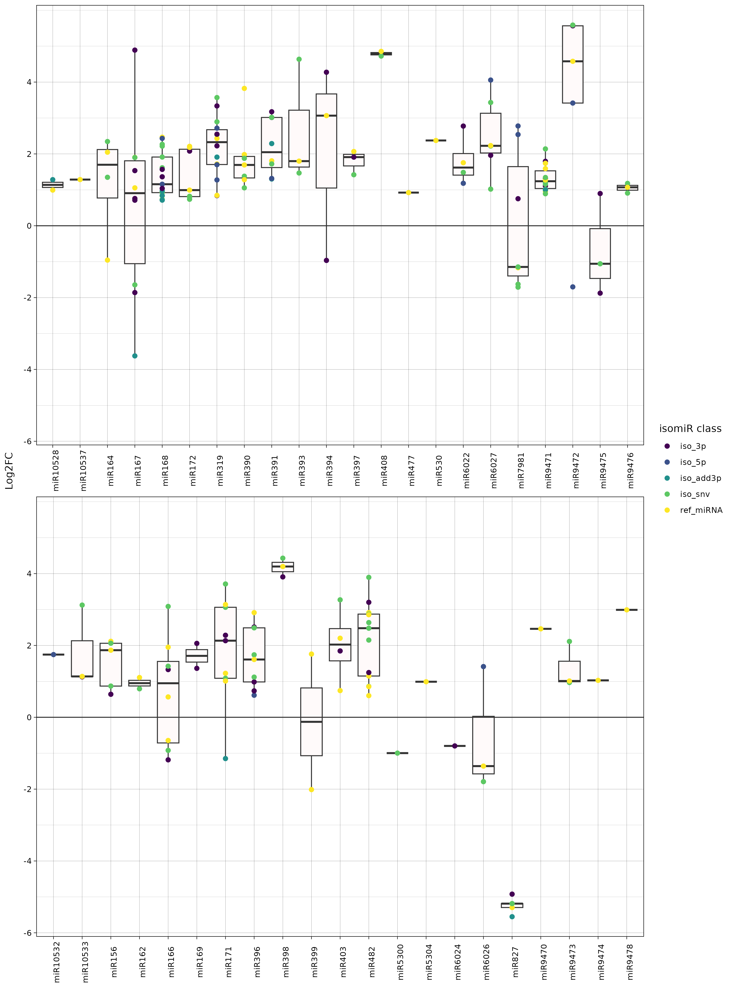

This tutorial provides a complete, end-to-end example of how to run miRdeX-nf using a real sRNA-seq dataset. The aim of this section is to offer a minimal, fully reproducible walkthrough that guides you through the essential steps of a microRNA analysis workflow:

- Preparing the **input data** (either local FASTQ files or SRA accessions)
- **Configuring** and **executing** the pipeline
- Inspecting the **generated outputs**
- Performing and understanding the initial **differential expression results**
  
In this demonstration, we use a small dataset obtained from the Sequence Read Archive (SRA) to showcase both ways of running the pipeline: (1) automatically **downloading the sequencing data from SRA** within the workflow, and (2) running the pipeline using **FASTQ files that are already available on your system**. The tutorial is intentionally simplified so you can learn the recommended project structure, the required input files, and the key pipeline steps before applying miRdeX-nf to your own full datasets.

## Dataset and biological question

Imagine you are a plant biologist working on tomatoes (Solanum lycopersicum) — a crop that plays a vital role in global agriculture. One morning, while having coffee and scrolling through the news, you see yet another headline:

> "Tomato mosaic virus (TOMV) outbreaks threaten tomato crops worldwide.”

You recognize the name immediately. TOMV is a viral pathogen of importance in plant pathology: persistent and capable of significantly reducing crop yields. Farmers see the symptoms. Researchers observe the molecular battle happening beneath
the surface.

As a scientist fascinated by **microRNAs**, you know how remarkable these molecules are. Tiny, elegant regulators that shape the plant’s response to stress — drought, salinity, pathogens… you name it. They’re fast, sensitive, and often make excellent **biomarkers** or even targets **for crop improvement**. So a scientific curiosity starts forming in your mind:

> "Do tomato plants adjust their miRNA expression when facing TOMV? And if so, which miRNAs are involved in the defense response?"

You decide to look for answers in real sequencing data.

In this tutorial, we’ll recreate that biological journey using a real experiment. You select a study from the SRA project [PRJNA439162](https://www.ncbi.nlm.nih.gov/bioproject/?term=PRJNA439162), which investigates the functional role of tomato DCL2b in plant development and defense against viruses. Although the focus of the study is on the role of DCL2b in small RNA biosynthesis and defense against TOMV, we’ll use part of their dataset to address our own question. This experiment involves *Solanum lycopersicum* (Alisa-Craig cultivar) plants that were infected with TOMV and compared to mock-treated healthy controls.

You can imagine the setup:

- **Six tomato plants** sitting in a growth chamber.
- **Three** are **infected** with TOMV             — SRR6872534, SRR6872536, SRR6872537
- **Three** remain **mock-treated** (non-infected) — SRR6866904, SRR6866905, SRR6866907
- After a defined infection period, tissues are collected, RNA is extracted, and small RNA libraries are prepared.
  
Small RNA sequencing captures the full repertoire of tiny regulatory molecules, including miRNAs, that the plant deploys during stress. The beauty of this dataset lies in its simplicity and clear biological contrast, making it a perfect real-world scenario for learning how to analyze plant miRNA responses using **miRdeX-nf**.

## Organizing your project before running the pipeline

After choosing your dataset and defining your biological question, you’re finally ready to begin the computational part of the journey. But before running any command, there’s a habit that every good bioinformatician learns early on: **keep your project organized**.

Imagine coming back to this analysis in three months. Will you remember where the FASTQ files were? Which metadata table belonged to which experiment? Where your samplesheet was? Or which command you used to run the pipeline?

A clean directory structure turns all of that confusion into clarity. Even though **miRdeX-nf** does not enforce any specific layout, creating a tidy workspace will make your analysis easier to follow, simpler to debug, and far more reproducible — both for you and anyone who might revisit your work.
At the very top level of your project, it helps to separate your pipeline code from your inputs and your outputs. In this tutorial, we’ll follow the structure below:

```
├── 00-Pipeline/
│      ├── miRdeX-nf/
│      └── run_mirdex.sh
├── 01-Input_data/
│      ├── 01-Metadata/
│      ├── 02-Libraries/
│      ├── 03-Accession_lists/
│      ├── 04-Samplesheets/
│      ├── 05-Databases/
│      └── 06-Genomes/
└── 02-Output/
```
The idea is simple:
- `00-Pipeline/`
  
  This is your “control room”. It contains the pipeline code itself (`miRdeX-nf/`) and the small script you’ll use to launch the workflow — for example, `run_mirdex.sh`, which stores the exact command needed to run your analysis. Keeping this script here makes it easy to rerun or modify the workflow without hunting through old shell histories.

- `01-Input_data/`
  
  Everything the pipeline needs lives here. You can group the inputs by type:
  - `01-Metadata/` — tables describing your samples and design
  - `02-Libraries/` — FASTQ files, when you already have them locally
  - `03-Accession_lists/` — SRA run lists for automated downloads
  - `04-Samplesheets/` — the samplesheet that tells the pipeline what to process
  - `05-Databases/` — optional filtering databases
  - `06-Genomes/` — genome FASTA files for sequence-based steps
  
  If you're working with multiple species or several SRA projects, you can extend the structure to make things even clearer, for example:
  ```
  01-Input_data/
  ├── 02-Libraries/
  │      └── Solanum_lycopersicum/
  │              └── PRJNA439162/
  ├── 03-Accession_lists/
  │      └── Solanum_lycopersicum/
  │              └── PRJNA439162/
  ```
  This extra layer is optional but extremely helpful when you handle more than one organism or dataset.

- `02-Output/`
  
  A dedicated home for everything miRdeX-nf generates — QC summaries, count matrices, reports, differential expression tables, visualizations, and logs. Storing outputs separately means you never mix results with raw data or code.

Organizing your project this way may feel like a small step, but it pays off quickly. It ensures that your analysis is **transparent, reproducible, and easy to resume** — even long after you’ve finished the tutorial. With this structure in place, it’s time to prepare the actual inputs, depending on how you plan to run the pipeline: starting from **SRA accessions** or from **existing FASTQ files**.

## Preparing the input files for the analysis

With your project structure in place and the biological question clearly defined, it’s time to give **miRdeX-nf** something to work with. In practice, this means preparing the input files that describe what should be analyzed and how it should be interpreted.
Depending on your situation, you might be in one of two scenarios:
- You already have the small RNA libraries as **FASTQ files**.
- You prefer to let the pipeline **download everything from SRA**.
  
miRdeX-nf is designed to handle both, and even to mix them in the same run — for example, when you’re combining your own data with public datasets.

In this tutorial, we will prepare the inputs for the **six tomato samples** PRJNA439162, but the same logic applies to any dataset you work with.

### Input option A: starting from FASTQ files

Let’s start with the most direct scenario: you already have your **sRNA-seq libraries** in FASTQ or FASTQ.gz format. Maybe they came straight from your sequencing provider, or you downloaded them from SRA using your favorite tools. In either case, miRdeX-nf can use them as they are.

Following the directory layout introduced earlier, the FASTQ files for this tutorial would live here:

```
├── 00-Pipeline/
│      ├── miRdeX-nf/
│      └── run_mirdex.sh
├── 01-Input_data/
│      ├── 01-Metadata/
│      ├── 02-Libraries/
│      │      └── Solanum_lycopersicum/
│      │              └── PRJNA439162/
│      │                      ├── SRR6866904.fastq.gz
│      │                      ├── SRR6866905.fastq.gz
│      │                      ├── SRR6866907.fastq.gz
│      │                      ├── SRR6872534.fastq.gz
│      │                      ├── SRR6872536.fastq.gz
│      │                      └── SRR6872537.fastq.gz
│      ├── 03-Accession_lists/
│      ├── 04-Samplesheets/
│      ├── 05-Databases/
│      └── 06-Genomes/
└── 02-Output/
```

In this setup, each file is one small RNA library corresponding to a single tomato sample. miRdeX-nf will pick them up later through the samplesheet, so at this stage, your only job is to make sure they are stored in a clear, consistent location.

### Input option B: starting from SRA accession lists

Now imagine a different scenario: you don’t have any FASTQ files yet, and you don’t necessarily want to download them manually. Perhaps you’re exploring several public datasets and want the pipeline to handle the retrieval for you.

In that case, miRdeX-nf can start directly from an **SRA accession list**. Instead of placing FASTQ files under `02-Libraries/`, you provide a simple text file with one **SRA run accession per line**, and the workflow will download the corresponding libraries automatically.

For this tutorial, the accession list for PRJNA439162 could be called `sly_PRJNA439162.txt` and contain:

```
SRR6866904
SRR6866905
SRR6866907
SRR6872534
SRR6872536
SRR6872537
```

Following the same species/project organization as before, this file fits naturally into:

```
├── 00-Pipeline/
│      ├── miRdeX-nf/
│      └── run_mirdex.sh
├── 01-Input_data/
│      ├── 01-Metadata/
│      ├── 02-Libraries/
│      ├── 03-Accession_lists/
│      │      └── Solanum_lycopersicum/
│      │              └── PRJNA439162/
│      │                      └── sly_PRJNA439162.txt
│      ├── 04-Samplesheets/
│      ├── 05-Databases/
│      └── 06-Genomes/
└── 02-Output/
```

From the user’s point of view, the only difference between using FASTQ files or an accession list is **what you write in the samplesheet**; the rest of the tutorial remains identical.

### Preparing the metadata file

Sequencing files tell miRdeX-nf *what* was sequenced, but not *what those samples represent*. For that, the pipeline relies on a **metadata file**: a table describing the biological and experimental context of each run.

This file is **essential** for downstream differential expression analysis because it defines:

- the **biological condition** (e.g., mock vs infected)
- the **replicate structure**
- the **experimental variables** to model (e.g., Treatment, Time, Batch)
- the **design formula** and **contrast** to test
- …and other descriptors relevant to differential expression analysis

For this tutorial, the metadata for the selected tomato samples is stored in:

`sly_m_PRJNA439162.tsv`

and is placed following the same species/project organization used throughout the input structure:

```
├── 00-Pipeline/
│      ├── miRdeX-nf/
│      └── run_mirdex.sh
├── 01-Input_data/
│      ├── 01-Metadata/
│      │      └── Solanum_lycopersicum/
│      │              └── PRJNA439162/
│      │                      └── sly_m_PRJNA439162.tsv
│      ├── 02-Libraries/
│      ├── 03-Accession_lists/
│      ├── 04-Samplesheets/
│      ├── 05-Databases/
│      └── 06-Genomes/
└── 02-Output/
```

Below is the metadata file used to annotate the experimental design of the selected samples:


<div class="long-table-container">
  <table class="long-table">
    <thead>
      <tr>
        <th>Group</th>
        <th>Species</th>
        <th>Project</th>
        <th>Run</th>
        <th>Treatment</th>
        <th>Replicate</th>
        <th>Level</th>
        <th>Time</th>
        <th>Cultivar</th>
        <th>Tissue</th>
        <th>Stage</th>
        <th>Genotype</th>
        <th>Batch</th>
        <th>Test</th>
        <th>Design</th>
        <th>DesignRef</th>
        <th>DesignRed</th>
        <th>Contrast</th>
      </tr>
    </thead>
    <tbody>
      <tr>
        <td>1</td>
        <td><i>Solanum lycopersicum</i></td>
        <td>PRJNA439162</td>
        <td>SRR6866904</td>
        <td>None</td>
        <td>1</td>
        <td>L.0</td>
        <td>T.0</td>
        <td>alisa-craig</td>
        <td>leaves</td>
        <td>D.0</td>
        <td>G.0</td>
        <td>B.0</td>
        <td>Wald</td>
        <td>~ Treatment</td>
        <td>Treatment(None)</td>
        <td>DR.0</td>
        <td>CT.0</td>
      </tr>
      <tr>
        <td>1</td>
        <td><i>Solanum lycopersicum</i></td>
        <td>PRJNA439162</td>
        <td>SRR6866905</td>
        <td>None</td>
        <td>2</td>
        <td>L.0</td>
        <td>T.0</td>
        <td>alisa-craig</td>
        <td>leaves</td>
        <td>D.0</td>
        <td>G.0</td>
        <td>B.0</td>
        <td>Wald</td>
        <td>~ Treatment</td>
        <td>Treatment(None)</td>
        <td>DR.0</td>
        <td>CT.0</td>
      </tr>
      <tr>
        <td>1</td>
        <td><i>Solanum lycopersicum</i></td>
        <td>PRJNA439162</td>
        <td>SRR6866907</td>
        <td>None</td>
        <td>3</td>
        <td>L.0</td>
        <td>T.0</td>
        <td>alisa-craig</td>
        <td>leaves</td>
        <td>D.0</td>
        <td>G.0</td>
        <td>B.0</td>
        <td>Wald</td>
        <td>~ Treatment</td>
        <td>Treatment(None)</td>
        <td>DR.0</td>
        <td>CT.0</td>
      </tr>
      <tr>
        <td>1</td>
        <td><i>Solanum lycopersicum</i></td>
        <td>PRJNA439162</td>
        <td>SRR6872534</td>
        <td>tomv</td>
        <td>1</td>
        <td>L.0</td>
        <td>T.0</td>
        <td>alisa-craig</td>
        <td>leaves</td>
        <td>D.0</td>
        <td>G.0</td>
        <td>B.0</td>
        <td>Wald</td>
        <td>~ Treatment</td>
        <td>Treatment(None)</td>
        <td>DR.0</td>
        <td>CT.0</td>
      </tr>
      <tr>
        <td>1</td>
        <td><i>Solanum lycopersicum</i></td>
        <td>PRJNA439162</td>
        <td>SRR6872536</td>
        <td>tomv</td>
        <td>2</td>
        <td>L.0</td>
        <td>T.0</td>
        <td>alisa-craig</td>
        <td>leaves</td>
        <td>D.0</td>
        <td>G.0</td>
        <td>B.0</td>
        <td>Wald</td>
        <td>~ Treatment</td>
        <td>Treatment(None)</td>
        <td>DR.0</td>
        <td>CT.0</td>
      </tr>
      <tr>
        <td>1</td>
        <td><i>Solanum lycopersicum</i></td>
        <td>PRJNA439162</td>
        <td>SRR6872537</td>
        <td>tomv</td>
        <td>3</td>
        <td>L.0</td>
        <td>T.0</td>
        <td>alisa-craig</td>
        <td>leaves</td>
        <td>D.0</td>
        <td>G.0</td>
        <td>B.0</td>
        <td>Wald</td>
        <td>~ Treatment</td>
        <td>Treatment(None)</td>
        <td>DR.0</td>
        <td>CT.0</td>
      </tr>
    </tbody>
  </table>
</div>

In words, this metadata tells miRdeX-nf:

> *“Compare infected versus mock plants, using Treatment as the main factor and testing for the effect of infection.”*

### Preparing a database to remove unwanted RNA sequences

Real small RNA libraries are rarely “pure”. They often contain large numbers of reads coming from ribosomal RNAs (rRNAs) or other abundant **non-regulatory RNAs**. In plant datasets, this is especially common and can easily dominate the library.

To help identify and remove these unwanted fragments, miRdeX-nf allows the use of an **external reference database** (such as a collection of plant rRNAs). miRdeX-nf can run perfectly well **without** such a database, but providing one enables an early filtering step that clears out these non-regulatory sequences and lets the downstream analysis focus on the miRNA signal.

For the tutorial, we include a **plant rRNA reference** downloaded from RNAcentral. rRNA fragments:
- do not carry regulatory information,
- can massively inflate library sizes, and
- may distort normalization if left in the data.
  
By removing them, we reduce noise and let genuine small RNA signals stand out more clearly.

Following the input structure, the rRNA database is placed under `05-Databases/`:

```
├── 00-Pipeline/
│      ├── miRdeX-nf/
│      └── run_mirdex.sh
├── 01-Input_data/
│      ├── 01-Metadata/
│      ├── 02-Libraries/
│      ├── 03-Accession_lists/
│      ├── 04-Samplesheets/
│      ├── 05-Databases/
│      │      └── rRNA/
│      │              └── plant_rRNA_rnacentral.fasta
│      └── 06-Genomes/
└── 02-Output/
```

Later, this file will be passed to miRdeX-nf through a **command-line** option instead of via the samplesheet.

### Preparing the reference genome

miRdeX-nf can use a reference genome during several parts of the workflow, but its importance becomes especially clear when working with isomiR annotation. By default, the pipeline annotates both canonical miRNAs and their isoforms, and this step requires the presence of a genome to ensure that detected variants truly originate from the expected miRNA precursors.
Some sequence variants may resemble isomiRs at first glance, but actually arise from unrelated genomic regions. Providing a genome allows miRdeX-nf to exclude these spurious alignments and keep only genuine isoforms supported by the precursor locus.

Whether the genome is required or optional depends on the analysis mode:

<table class="base-table full-width-table">
  <thead>
    <tr>
      <th>Analysis scenario</th>
      <th>Is the genome required?</th>
    </tr>
  </thead>
  <tbody>
    <tr>
      <td>Annotating isomiRs (default behavior)</td>
      <td><strong>Yes</strong></td>
    </tr>
    <tr>
      <td>Using sequence-based filtering</td>
      <td><strong>Yes</strong></td>
    </tr>
    <tr>
      <td>Detecting only canonical miRNAs, without genome filtering</td>
      <td><strong>No</strong></td>
    </tr>
  </tbody>
</table>


For this tutorial, we include the **tomato reference genome** because miRdeX-nf will annotate isomiRs. However, we will not use the genome for read filtering, since strict filtering may remove legitimate isoforms that differ slightly from the reference sequence.

The genome might be placed in the `06-Genomes` directory following the same species/project structure used for the other inputs:

```
├── 00-Pipeline/
│      ├── miRdeX-nf/
│      └── run_mirdex.sh
├── 01-Input_data/
│      ├── 01-Metadata/
│      ├── 02-Libraries/
│      ├── 03-Accession_lists/
│      ├── 04-Samplesheets/
│      ├── 05-Databases/
│      └── 06-Genomes/
│              └── Solanum_lycopersicum/
│                      └── GCF_036512215.1_SLMr2.1_genomic.fna
└── 02-Output/
```

### Preparing the samplesheet

Once all input files are organized — FASTQ libraries or SRA accession lists, the metadata table, and the reference genome — the next step is to bring them together in the **samplesheet**. This file is the central piece of information for miRdeX-nf because it is the only input that you pass directly to Nextflow via the `--input` parameter. Everything that the pipeline needs to know about your dataset is derived from this table.

The `samplesheet.csv` file must contain the following columns:


<table class="base-table full-width-table column-narrow-first">
  <thead>
    <tr>
      <th>Column</th>
      <th>Description</th>
    </tr>
  </thead>
  <tbody>
    <tr>
      <td><code>Id</code></td>
      <td>A short label for the input (sample name, run ID, or project ID).</td>
    </tr>
    <tr>
      <td><code>File</code></td>
      <td>Path to a FASTQ file or to an SRA accession list.</td>
    </tr>
    <tr>
      <td><code>Metadata</code></td>
      <td>Path to the metadata <code>.tsv</code> file describing the samples.</td>
    </tr>
    <tr>
      <td><code>Genome</code></td>
      <td>Path to the genome FASTA (required when annotating isomiRs).</td>
    </tr>
    <tr>
      <td><code>Group</code></td>
      <td>Only used when the input is a count matrix. Leave empty otherwise.</td>
    </tr>
  </tbody>
</table>


The samplesheet only contains information that **changes from project to project**: the path to each FASTQ file (or to the SRA accession list), the metadata file describing the experiment, and the genome file (when required).

Each row defines one analysis unit, and its meaning depends on the input type:
- With FASTQ input, **each FASTQ library** corresponds to **one row**.
- With SRA input, **each accession list** corresponds to **one row**.
- With count matrices, **each matrix** is **one row**, and the `Group` column becomes **mandatory**.
  
All these modes can be combined freely in the same samplesheet, allowing you to analyze multiple projects, species, or input types simultaneously in a single execution.

At this point you might be wondering:

**“And what about the rRNA database we prepared earlier? Shouldn’t it also be included in the samplesheet?”**

It’s a natural question — but the answer is **no**.

The samplesheet is intentionally simple and only describes project-specific inputs. Resources that are shared across the whole analysis, such as rRNA databases, adapters, or other filtering elements, are provided later as command-line options when launching the pipeline. We will return to this shortly.

#### Samplesheet for FASTQ input

For our tutorial dataset, if you are working with the FASTQ files locally, the samplesheet simply includes one row for each of the six tomato libraries. Using the directory structure shown before, the samplesheet looks like this:

```
Id,File,Metadata,Genome,Group
SRR6866904,/your_path/01-Input_data/02-Libraries/Solanum_lycopersicum/PRJNA439162/SRR6866904.fastq.gz,/your_path/01-Input_data/01-Metadata/Solanum_lycopersicum/PRJNA439162/sly_m_PRJNA439162.tsv,/your_path/01-Input_data/06-Genomes/Solanum_lycopersicum/GCF_036512215.1_SLMr2.1_genomic.fna,
SRR6866905,/your_path/01-Input_data/02-Libraries/Solanum_lycopersicum/PRJNA439162/SRR6866905.fastq.gz,/your_path/01-Input_data/01-Metadata/Solanum_lycopersicum/PRJNA439162/sly_m_PRJNA439162.tsv,/your_path/01-Input_data/06-Genomes/Solanum_lycopersicum/GCF_036512215.1_SLMr2.1_genomic.fna,
SRR6866907,/your_path/01-Input_data/02-Libraries/Solanum_lycopersicum/PRJNA439162/SRR6866907.fastq.gz,/your_path/01-Input_data/01-Metadata/Solanum_lycopersicum/PRJNA439162/sly_m_PRJNA439162.tsv,/your_path/01-Input_data/06-Genomes/Solanum_lycopersicum/GCF_036512215.1_SLMr2.1_genomic.fna,
SRR6872534,/your_path/01-Input_data/02-Libraries/Solanum_lycopersicum/PRJNA439162/SRR6872534.fastq.gz,/your_path/01-Input_data/01-Metadata/Solanum_lycopersicum/PRJNA439162/sly_m_PRJNA439162.tsv,/your_path/01-Input_data/06-Genomes/Solanum_lycopersicum/GCF_036512215.1_SLMr2.1_genomic.fna,
SRR6872536,/your_path/01-Input_data/02-Libraries/Solanum_lycopersicum/PRJNA439162/SRR6872536.fastq.gz,/your_path/01-Input_data/01-Metadata/Solanum_lycopersicum/PRJNA439162/sly_m_PRJNA439162.tsv,/your_path/01-Input_data/06-Genomes/Solanum_lycopersicum/GCF_036512215.1_SLMr2.1_genomic.fna,
SRR6872537,/your_path/01-Input_data/02-Libraries/Solanum_lycopersicum/PRJNA439162/SRR6872537.fastq.gz,/your_path/01-Input_data/01-Metadata/Solanum_lycopersicum/PRJNA439162/sly_m_PRJNA439162.tsv,/your_path/01-Input_data/06-Genomes/Solanum_lycopersicum/GCF_036512215.1_SLMr2.1_genomic.fna,
```
This tells the pipeline:

> *Use these six FASTQ files as input, and analyze them using this metadata and this genome.*

#### Samplesheet for SRA accession list input

If instead you want miRdeX-nf to download the sequencing data automatically from the SRA, the samplesheet for this tutorial contains a single row, pointing to the accession list file where all six run IDs are listed:
```
Id,File,Metadata,Genome,Group
PRJNA439162,01-Input_data/03-Accession_lists/Solanum_lycopersicum/PRJNA439162/sly_PRJNA439162.txt,01-Input_data/01-Metadata/Solanum_lycopersicum/PRJNA439162/sly_m_PRJNA439162.tsv,01-Input_data/06-Genomes/Solanum_lycopersicum/GCF_036512215.1_SLMr2.1_genomic.fna,
```

This tells the pipeline:

> *Download all runs listed in sly_PRJNA439162.txt and analyze them using this metadata and genome.*

:::info
miRdeX-nf also allows combining different input types in the same samplesheet. This is particularly useful when some datasets are already downloaded as FASTQ files, others must be retrieved from SRA, or when you want to analyze multiple projects in a single execution.

```
Id,File,Metadata,Genome,Group
SRR6866904,/your_path/01-Input_data/02-Libraries/Solanum_lycopersicum/PRJNA439162/SRR6866904.fastq.gz,/your_path/01-Input_data/01-Metadata/Solanum_lycopersicum/PRJNA439162/sly_m_PRJNA439162.tsv,/your_path/01-Input_data/06-Genomes/Solanum_lycopersicum/GCF_036512215.1_SLMr2.1_genomic.fna,
SRR6866905,/your_path/01-Input_data/02-Libraries/Solanum_lycopersicum/PRJNA439162/SRR6866905.fastq.gz,/your_path/01-Input_data/01-Metadata/Solanum_lycopersicum/PRJNA439162/sly_m_PRJNA439162.tsv,/your_path/01-Input_data/06-Genomes/Solanum_lycopersicum/GCF_036512215.1_SLMr2.1_genomic.fna,
SRR6866907,/your_path/01-Input_data/02-Libraries/Solanum_lycopersicum/PRJNA439162/SRR6866907.fastq.gz,/your_path/01-Input_data/01-Metadata/Solanum_lycopersicum/PRJNA439162/sly_m_PRJNA439162.tsv,/your_path/01-Input_data/06-Genomes/Solanum_lycopersicum/GCF_036512215.1_SLMr2.1_genomic.fna,
SRR6872534,/your_path/01-Input_data/02-Libraries/Solanum_lycopersicum/PRJNA439162/SRR6872534.fastq.gz,/your_path/01-Input_data/01-Metadata/Solanum_lycopersicum/PRJNA439162/sly_m_PRJNA439162.tsv,/your_path/01-Input_data/06-Genomes/Solanum_lycopersicum/GCF_036512215.1_SLMr2.1_genomic.fna,
SRR6872536,/your_path/01-Input_data/02-Libraries/Solanum_lycopersicum/PRJNA439162/SRR6872536.fastq.gz,/your_path/01-Input_data/01-Metadata/Solanum_lycopersicum/PRJNA439162/sly_m_PRJNA439162.tsv,/your_path/01-Input_data/06-Genomes/Solanum_lycopersicum/GCF_036512215.1_SLMr2.1_genomic.fna,
SRR6872537,/your_path/01-Input_data/02-Libraries/Solanum_lycopersicum/PRJNA439162/SRR6872537.fastq.gz,/your_path/01-Input_data/01-Metadata/Solanum_lycopersicum/PRJNA439162/sly_m_PRJNA439162.tsv,/your_path/01-Input_data/06-Genomes/Solanum_lycopersicum/GCF_036512215.1_SLMr2.1_genomic.fna,
PRJNA291520,01-Input_data/03-Accession_lists/Arabidopsis_thaliana/PRJNA291520/ath_PRJNA291520.txt,01-Input_data/01-Metadata/Arabidopsis_thaliana/PRJNA291520/ath_m_PRJNA291520.tsv,01-Input_data/06-Genomes/Arabidopsis_thaliana/TAIR10.fasta,
```
In this mixed setup, miRdeX-nf would analyze the six tomato FASTQ libraries of this tutorial, while simultaneously downloading and processing all SRA runs listed for the Arabidopsis project PRJNA291520. Each row is handled independently: FASTQ files are read directly, SRA runs are downloaded on the fly, and all results are stored in an organized way under the output directory.

For a full description of every column, valid combinations, and more advanced examples, consult the usage documentation included with miRdeX-nf.
:::

## Running the pipeline

Once your samplesheet is ready and all input files are organized, the next step is simply to **run miRdeX-nf** and let the workflow take care of the rest. At this stage, all the essential components of the analysis are already in place — the pipeline just needs to be launched. For this tutorial, we assume that the pipeline code lives in:

`00-Pipeline/miRdeX-nf/`

A simple and elegant way to run the workflow is to prepare a small bash script inside the `00-Pipeline/` directory. This may feel like a small detail, but it pays off almost immediately:

- You keep a **clear and reproducible record** of exactly how the analysis was executed.
- You can **re-run the workflow** at any time—even months later—without reconstructing a long command.

Below is the script tailored for this tutorial. Save it as `run_mirdex.sh` in `00-Pipeline/`:

```
#!/bin/bash

nextflow run main.nf \
    --input ../../01-Input_data/04-Samplesheets/samplesheet_isomirs.csv \
    --outdir ../../02-Output \
    --email your_email@example.com \
    --filt_db ../../01-Input_data/05-Databases/rRNA/plant_rRNA_rnacentral.fasta \
    --databases 'mirbase,srnaanno,pmiren' \
    --relative_abundance 0.01 \
    --global_matrix \
    --custom_config conf/garnatxa.config \
    -profile singularity \
    -resume
```

You can **run it** simply with:

```
bash run_mirdex.sh
```

That single command triggers the entire workflow: downloading data (if needed), trimming, filtering, quantifying, annotating, generating matrices, performing the full differential expression analysis, producing QC summaries, and generating all final outputs.

If you’ve reached this point and launched the pipeline successfully — **congratulations!** 🎉 You’ve just run miRdeX-nf on a real plant–pathogen dataset, with a fully structured and reproducible analysis setup.

:::info
If you plan to **run miRdeX-nf** on a **high-performance computing (HPC) system**, you can place the exact same Nextflow command inside a SLURM submission script. This ensures that your job uses the correct queue, memory, time limits, and modules required by your cluster.

In addition to the SLURM script itself, you might also need to create a custom Nextflow configuration file tailored to your HPC setup. This configuration typically defines the cluster executor (slurm), available queues, resource limits, module loading policies, container paths, and any system-specific settings. You can place this file inside the conf/ directory and load it with the `--custom_config` parameter.

Below is an example of how the script from this tutorial would look when adapted for SLURM. Make sure to adjust the headers (`--time`, `--mem`, `--qos`, etc.) to match the policies of your HPC environment.

```
#!/bin/bash

#SBATCH --job-name=miRdeX-nf                      # Job name
#SBATCH --output=miRdeX-nf_isomirs.log            # Standard output and error log
#SBATCH --qos=short                               # Partition / queue
#SBATCH --ntasks=1                                 # Number of tasks
#SBATCH --cpus-per-task=1                          # Number of CPUs per task
#SBATCH --time=1-00:00:00                          # Time limit (D-HH:MM:SS)
#SBATCH --mem-per-cpu=6gb                          # Memory per CPU

# Load required modules
module load singularity
module load nextflow

# Run the pipeline
nextflow run main.nf \
    --input ../../01-Input_data/04-Samplesheets/samplesheet_isomirs.csv \
    --outdir ../../02-Output \
    --email your_email@example.com \
    --filt_db ../../01-Input_data/05-Databases/rRNA/plant_rRNA_rnacentral.fasta \
    --databases 'mirbase,srnaanno,pmiren' \
    --relative_abundance 0.01 \
    --global_matrix \
    --custom_config conf/garnatxa.config \
    -profile singularity \
    -resume
```
Submit the job with:

```
sbatch run_mirdex_slurm.sh
```
:::

## Monitoring the pipeline while it runs

After launching `run_mirdex.sh`, miRdeX-nf begins to unfold behind the scenes as Nextflow coordinates each stage of the workflow. Instead of running a single monolithic script, Nextflow executes dozens of small, independent tasks — trimming, filtering, mapping, quantifying — each tracked in real time.

To follow what’s happening, you have two main sources of information:
- The **terminal output** (or the SLURM log, if running on HPC)
- The `.nextflow.log` file generated automatically by Nextflow.

### Following progress in the terminal

As soon as the pipeline starts, Nextflow prints a brief header and then continuously updates a table showing the current status of every process. A typical view looks like this:


```
user@host:~/your_path/00-Pipeline$ bash run_mirdex.sh 
Nextflow 25.10.0 is available - Please consider updating your version to it

 N E X T F L O W   ~  version 24.10.6

WARN: It appears you have never run this project before -- Option `-resume` is ignored
Launching `miRdeX-nf/main.nf` [agitated_kilby] DSL2 - revision: 702a37db68


--------------------------------------------------------------
             _ ____     _     __  __                  __ 
   _ __ ___ (_)  _ \ __| | ___\ \/ /           _ __  / _| 
  | '_ ` _ \| | |_) / _` |/ _ \\  /   _____   | '_ \| |_ 
  | | | | | | |  _ < (_| |  __//  \  |_____|  | | | |  _| 
  |_| |_| |_|_|_| \_\__,_|\__//_/\_\          |_| |_|_|  

                       Version: 1.0.0
--------------------------------------------------------------


Input/output options
  input          : /your_path/01-Input/04-Samplesheets/samplesheet.csv
  outdir         : /your_path/02-Output

Filtering options
  filt_db        : /your_path/01-Input/05-Databases/rnacentral_viridiplantae_rRNA_29_05_2025.fasta

Annotation options
  reuse_dbs      : false

Core Nextflow options
  runName        : agitated_kilby
  containerEngine: docker
  launchDir      : /your_path/00-Pipeline
  workDir        : /your_path/00-Pipeline/work
  projectDir     : /your_path/00-Pipeline/miRdeX-nf
  userName       : user
  profile        : docker
  configFiles    : 

!! Only displaying parameters that differ from the pipeline defaults !!
------------------------------------------------------
* miRdeX-nf GitHub repository:
    https://github.com/antoglz/miRdeX-nf

* Software dependencies:
    https://github.com/antoglz/miRdeX-nf/blob/master/CITATIONS.md

executor >  local (14)
[c6/c2d9c1] process > MAIN_MIRDEX:MIRDEX:FASTQ_DOWNLOAD_PREFETCH_FASTERQDUMP_SRATOOLS:CUSTOM_SRATOOLSNCBISETTINGS (ncbi-settings) [100%] 1 of 1 ✔
[63/9aa1fb] process > MAIN_MIRDEX:MIRDEX:FASTQ_DOWNLOAD_PREFETCH_FASTERQDUMP_SRATOOLS:SRATOOLS_PREFETCH (SRR6866905)              [100%] 6 of 6 ✔
[c0/5b0759] process > MAIN_MIRDEX:MIRDEX:FASTQ_DOWNLOAD_PREFETCH_FASTERQDUMP_SRATOOLS:SRATOOLS_FASTERQDUMP (SRR6872537)           [  0%] 0 of 6
[-        ] process > MAIN_MIRDEX:MIRDEX:QUALITY_CONTROL_RAW:FASTQC                                                               -
[-        ] process > MAIN_MIRDEX:MIRDEX:QUALITY_CONTROL_RAW:MULTIQC                                                              -
[-        ] process > MAIN_MIRDEX:MIRDEX:FASTP                                                                                    -
[-        ] process > MAIN_MIRDEX:MIRDEX:QUALITY_CONTROL_TRIM:FASTQC                                                              -
[-        ] process > MAIN_MIRDEX:MIRDEX:QUALITY_CONTROL_TRIM:MULTIQC                                                             -
[-        ] process > MAIN_MIRDEX:MIRDEX:VALIDATION:LIBRARIES_VALIDATION                                                          -
[49/7f2450] process > MAIN_MIRDEX:MIRDEX:FILTERING_DB:BOWTIE_BUILD (Filtering database)                                           [100%] 1 of 1 ✔
[-        ] process > MAIN_MIRDEX:MIRDEX:FILTERING_DB:BOWTIE_ALIGN_DB                                                             -
[-        ] process > MAIN_MIRDEX:MIRDEX:QUANTIFICATION:COUNTS                                                                    -
[-        ] process > MAIN_MIRDEX:MIRDEX:QUANTIFICATION:COUNTS_MATRIX_RAW                                                         -
[-        ] process > MAIN_MIRDEX:MIRDEX:DIFFEXPANALYSIS                                                                          -
[2c/d0e397] process > MAIN_MIRDEX:MIRDEX:ANNOTATION:PREPARE_MIRNA_DATABASES:DOWNLOAD_DB                                           [  0%] 0 of 1
[-        ] process > MAIN_MIRDEX:MIRDEX:ANNOTATION:PREPARE_MIRNA_DATABASES:DNA_RNA_CONVERTER                                     -
[-        ] process > MAIN_MIRDEX:MIRDEX:ANNOTATION:PREPARE_MIRNA_DATABASES:SPLIT_DB_BY_SPECIES                                   -
[-        ] process > MAIN_MIRDEX:MIRDEX:ANNOTATION:PREPARE_MIRNA_DATABASES:COLLAPSE_DB                                           -
[-        ] process > MAIN_MIRDEX:MIRDEX:ANNOTATION:COUNTS                                                                        -
[-        ] process > MAIN_MIRDEX:MIRDEX:ANNOTATION:RPM                                                                           -
[-        ] process > MAIN_MIRDEX:MIRDEX:ANNOTATION:SEQKIT_FQ2FA                                                                  -
[-        ] process > MAIN_MIRDEX:MIRDEX:ANNOTATION:SEQKIT_RMDUP                                                                  -
[-        ] process > MAIN_MIRDEX:MIRDEX:ANNOTATION:ISOMIRS_IDENTIFICATION:COMPLETE_BLASTN_MATURE:BLAST_MAKEBLASTDB               -
[-        ] process > MAIN_MIRDEX:MIRDEX:ANNOTATION:ISOMIRS_IDENTIFICATION:COMPLETE_BLASTN_MATURE:BLAST_BLASTN                    -
[-        ] process > MAIN_MIRDEX:MIRDEX:ANNOTATION:ISOMIRS_IDENTIFICATION:COMPLETE_BLASTN_MATURE:ADD_SEQUENCES_BLAST             -
[-        ] process > MAIN_MIRDEX:MIRDEX:ANNOTATION:ISOMIRS_IDENTIFICATION:COMPLETE_BLASTN_PRECURSOR:BLAST_MAKEBLASTDB            -
[-        ] process > MAIN_MIRDEX:MIRDEX:ANNOTATION:ISOMIRS_IDENTIFICATION:COMPLETE_BLASTN_PRECURSOR:BLAST_BLASTN                 -
[-        ] process > MAIN_MIRDEX:MIRDEX:ANNOTATION:ISOMIRS_IDENTIFICATION:COMPLETE_BLASTN_PRECURSOR:ADD_SEQUENCES_BLAST          -
[-        ] process > MAIN_MIRDEX:MIRDEX:ANNOTATION:ISOMIRS_IDENTIFICATION:MERGE_AND_FILTER_MATURE_PRECURSOR_BLAST                -
[-        ] process > MAIN_MIRDEX:MIRDEX:ANNOTATION:ISOMIRS_IDENTIFICATION:ISOMIRS_PRECURSOR_CLASSIFICATION                       -
[-        ] process > MAIN_MIRDEX:MIRDEX:ANNOTATION:ISOMIRS_IDENTIFICATION:FILTER_NONTEMPLATED_ISOMIRS:TSV_TO_FASTA               -
[-        ] process > MAIN_MIRDEX:MIRDEX:ANNOTATION:ISOMIRS_IDENTIFICATION:FILTER_NONTEMPLATED_ISOMIRS:SEQKIT_RMDUP               -
[-        ] process > MAIN_MIRDEX:MIRDEX:ANNOTATION:ISOMIRS_IDENTIFICATION:FILTER_NONTEMPLATED_ISOMIRS:BOWTIE_BUILD               -
[-        ] process > MAIN_MIRDEX:MIRDEX:ANNOTATION:ISOMIRS_IDENTIFICATION:FILTER_NONTEMPLATED_ISOMIRS:BOWTIE_ALIGN_NONTEMPLATED  -
[-        ] process > MAIN_MIRDEX:MIRDEX:ANNOTATION:ISOMIRS_IDENTIFICATION:FILTER_NONTEMPLATED_ISOMIRS:FILTER_TSV_BY_FASTA        -
[-        ] process > MAIN_MIRDEX:MIRDEX:ANNOTATION:ISOMIRS_IDENTIFICATION:CONCAT_TSV                                             -
[-        ] process > MAIN_MIRDEX:MIRDEX:ANNOTATION:ADD_RAW_COUNTS_TO_ISOMIRS_DF                                                  -
[-        ] process > MAIN_MIRDEX:MIRDEX:ANNOTATION:ADD_RPM_TO_ISOMIRS_DF                                                         -
[-        ] process > MAIN_MIRDEX:MIRDEX:ANNOTATION:ISOMIRS_MIRNA_CLASSIFICATION                                                  -
[-        ] process > MAIN_MIRDEX:MIRDEX:ANNOTATION:FILTER_ISOMIRS_BY_ABUNDANCE                                                   -
[-        ] process > MAIN_MIRDEX:MIRDEX:CONCAT_FILTER_UNIQUE_GFF3                                                                -
[-        ] process > MAIN_MIRDEX:MIRDEX:ANNOTATE_DEA_RESULTS                                                                     -
```

Each line corresponds to a module of the pipeline:

- the prefix (e.g., QC:FASTQC_RAW) identifies the step being executed.
- the counter shows how many tasks have finished (e.g., “5 of 6”).
- the symbol reflects the status:
  - ✔ completed
  - ✘ failed

This gives you a quick, high-level snapshot of the workflow: which steps have completed, which are in progress, and how many samples remain. On a local machine, this information appears directly in your terminal. On an HPC system, the same output is written to the SLURM log file specified in the submission script, so you can monitor progress simply by inspecting that file.

When all tasks finish successfully, Nextflow prints a final summary with the total runtime and a list of completed processes.

```
user@host:~/your_path/00-Pipeline$ bash run_mirdex.sh 
Nextflow 25.10.0 is available - Please consider updating your version to it

 N E X T F L O W   ~  version 24.10.6

WARN: It appears you have never run this project before -- Option `-resume` is ignored
Launching `miRdeX-nf/main.nf` [agitated_kilby] DSL2 - revision: 702a37db68


--------------------------------------------------------------
             _ ____     _     __  __                  __ 
   _ __ ___ (_)  _ \ __| | ___\ \/ /           _ __  / _| 
  | '_ ` _ \| | |_) / _` |/ _ \\  /   _____   | '_ \| |_ 
  | | | | | | |  _ < (_| |  __//  \  |_____|  | | | |  _| 
  |_| |_| |_|_|_| \_\__,_|\__//_/\_\          |_| |_|_|  

                       Version: 1.0.0
--------------------------------------------------------------


Input/output options
  input          : /your_path/01-Input/04-Samplesheets/samplesheet.csv
  outdir         : /your_path/02-Output

Filtering options
  filt_db        : /your_path/01-Input/05-Databases/rnacentral_viridiplantae_rRNA_29_05_2025.fasta

Annotation options
  reuse_dbs      : false

Core Nextflow options
  runName        : agitated_kilby
  containerEngine: docker
  launchDir      : /your_path/00-Pipeline
  workDir        : /your_path/00-Pipeline/work
  projectDir     : /your_path/00-Pipeline/miRdeX-nf
  userName       : user
  profile        : docker
  configFiles    : 

!! Only displaying parameters that differ from the pipeline defaults !!
------------------------------------------------------
* miRdeX-nf GitHub repository:
    https://github.com/antoglz/miRdeX-nf

* Software dependencies:
    https://github.com/antoglz/miRdeX-nf/blob/master/CITATIONS.md

executor >  local (182)
[c6/c2d9c1] process > MAIN_MIRDEX:MIRDEX:FASTQ_DOWNLOAD_PREFETCH_FASTERQDUMP_SRATOOLS:CUSTOM_SRATOOLSNCBISETTINGS (ncbi-settings)                           [100%] 1 of 1 ✔
[63/9aa1fb] process > MAIN_MIRDEX:MIRDEX:FASTQ_DOWNLOAD_PREFETCH_FASTERQDUMP_SRATOOLS:SRATOOLS_PREFETCH (SRR6866905)                                        [100%] 6 of 6 ✔
[33/629ea9] process > MAIN_MIRDEX:MIRDEX:FASTQ_DOWNLOAD_PREFETCH_FASTERQDUMP_SRATOOLS:SRATOOLS_FASTERQDUMP (SRR6866905)                                     [100%] 6 of 6 ✔
[b4/ddd204] process > MAIN_MIRDEX:MIRDEX:QUALITY_CONTROL_RAW:FASTQC (SRR6866905_Raw)                                                                        [100%] 6 of 6 ✔
[f0/0e0026] process > MAIN_MIRDEX:MIRDEX:QUALITY_CONTROL_RAW:MULTIQC (PRJNA439162)                                                                          [100%] 1 of 1 ✔
[20/750308] process > MAIN_MIRDEX:MIRDEX:FASTP (SRR6866905)                                                                                                 [100%] 6 of 6 ✔
[49/3cba71] process > MAIN_MIRDEX:MIRDEX:QUALITY_CONTROL_TRIM:FASTQC (SRR6866905_Trimmed)                                                                   [100%] 6 of 6 ✔
[d0/0fb723] process > MAIN_MIRDEX:MIRDEX:QUALITY_CONTROL_TRIM:MULTIQC (PRJNA439162)                                                                         [100%] 1 of 1 ✔
[58/538074] process > MAIN_MIRDEX:MIRDEX:VALIDATION:LIBRARIES_VALIDATION (PRJNA439162)                                                                      [100%] 1 of 1 ✔
[49/7f2450] process > MAIN_MIRDEX:MIRDEX:FILTERING_DB:BOWTIE_BUILD (Filtering database)                                                                     [100%] 1 of 1 ✔
[47/01be3b] process > MAIN_MIRDEX:MIRDEX:FILTERING_DB:BOWTIE_ALIGN_DB (SRR6872537)                                                                          [100%] 6 of 6 ✔
[0c/ddd557] process > MAIN_MIRDEX:MIRDEX:QUANTIFICATION:COUNTS (SRR6872537)                                                                                 [100%] 6 of 6 ✔
[d1/c9a802] process > MAIN_MIRDEX:MIRDEX:QUANTIFICATION:COUNTS_MATRIX_RAW (PRJNA439162_1)                                                                   [100%] 1 of 1 ✔
[6d/e78957] process > MAIN_MIRDEX:MIRDEX:DIFFEXPANALYSIS (PRJNA439162_1)                                                                                    [100%] 1 of 1 ✔
[2c/d0e397] process > MAIN_MIRDEX:MIRDEX:ANNOTATION:PREPARE_MIRNA_DATABASES:DOWNLOAD_DB                                                                     [100%] 1 of 1 ✔
[65/6d1eb8] process > MAIN_MIRDEX:MIRDEX:ANNOTATION:PREPARE_MIRNA_DATABASES:DNA_RNA_CONVERTER (srnaanno_precursor)                                          [100%] 6 of 6 ✔
[d7/7adca2] process > MAIN_MIRDEX:MIRDEX:ANNOTATION:PREPARE_MIRNA_DATABASES:SPLIT_DB_BY_SPECIES (sly_srnaanno_mature)                                       [100%] 6 of 6 ✔
[85/a6cb1c] process > MAIN_MIRDEX:MIRDEX:ANNOTATION:PREPARE_MIRNA_DATABASES:COLLAPSE_DB (sly_srnaanno_mature)                                               [100%] 6 of 6 ✔
[65/ea008c] process > MAIN_MIRDEX:MIRDEX:ANNOTATION:COUNTS (SRR6872537)                                                                                     [100%] 6 of 6 ✔
[7b/29383a] process > MAIN_MIRDEX:MIRDEX:ANNOTATION:RPM (SRR6872537)                                                                                        [100%] 6 of 6 ✔
[3c/21343f] process > MAIN_MIRDEX:MIRDEX:ANNOTATION:SEQKIT_FQ2FA (SRR6872537)                                                                               [100%] 6 of 6 ✔
[db/f7206f] process > MAIN_MIRDEX:MIRDEX:ANNOTATION:SEQKIT_RMDUP (SRR6866905.rmdup)                                                                         [100%] 6 of 6 ✔
[a3/c8871c] process > MAIN_MIRDEX:MIRDEX:ANNOTATION:ISOMIRS_IDENTIFICATION:COMPLETE_BLASTN_MATURE:BLAST_MAKEBLASTDB (sly_mirbase_mature)                    [100%] 1 of 1 ✔
[18/ca43dd] process > MAIN_MIRDEX:MIRDEX:ANNOTATION:ISOMIRS_IDENTIFICATION:COMPLETE_BLASTN_MATURE:BLAST_BLASTN (SRR6872537)                                 [100%] 6 of 6 ✔
[e6/5e12b2] process > MAIN_MIRDEX:MIRDEX:ANNOTATION:ISOMIRS_IDENTIFICATION:COMPLETE_BLASTN_MATURE:ADD_SEQUENCES_BLAST (SRR6866907_sly_mirbase_mature)       [100%] 6 of 6 ✔
[72/043247] process > MAIN_MIRDEX:MIRDEX:ANNOTATION:ISOMIRS_IDENTIFICATION:COMPLETE_BLASTN_PRECURSOR:BLAST_MAKEBLASTDB (sly_mirbase_precursor)              [100%] 1 of 1 ✔
[f3/92aa67] process > MAIN_MIRDEX:MIRDEX:ANNOTATION:ISOMIRS_IDENTIFICATION:COMPLETE_BLASTN_PRECURSOR:BLAST_BLASTN (SRR6872537)                              [100%] 6 of 6 ✔
[07/1dbe8b] process > MAIN_MIRDEX:MIRDEX:ANNOTATION:ISOMIRS_IDENTIFICATION:COMPLETE_BLASTN_PRECURSOR:ADD_SEQUENCES_BLAST (SRR6866907_sly_mirbase_precursor) [100%] 6 of 6 ✔
[cc/d8129b] process > MAIN_MIRDEX:MIRDEX:ANNOTATION:ISOMIRS_IDENTIFICATION:MERGE_AND_FILTER_MATURE_PRECURSOR_BLAST (SRR6866907)                             [100%] 6 of 6 ✔
[3b/6a303a] process > MAIN_MIRDEX:MIRDEX:ANNOTATION:ISOMIRS_IDENTIFICATION:ISOMIRS_PRECURSOR_CLASSIFICATION (SRR6866907)                                    [100%] 6 of 6 ✔
[d1/a7b601] process > MAIN_MIRDEX:MIRDEX:ANNOTATION:ISOMIRS_IDENTIFICATION:FILTER_NONTEMPLATED_ISOMIRS:TSV_TO_FASTA (SRR6866907)                            [100%] 6 of 6 ✔
[13/bbf4f2] process > MAIN_MIRDEX:MIRDEX:ANNOTATION:ISOMIRS_IDENTIFICATION:FILTER_NONTEMPLATED_ISOMIRS:SEQKIT_RMDUP (SRR6866907)                            [100%] 6 of 6 ✔
[b6/69675f] process > MAIN_MIRDEX:MIRDEX:ANNOTATION:ISOMIRS_IDENTIFICATION:FILTER_NONTEMPLATED_ISOMIRS:BOWTIE_BUILD (GCF_036512215.1_SLM_r2.1_genomic)      [100%] 1 of 1 ✔
[46/0eaa69] process > MAIN_MIRDEX:MIRDEX:ANNOTATION:ISOMIRS_IDENTIFICATION:FILTER_NONTEMPLATED_ISOMIRS:BOWTIE_ALIGN_NONTEMPLATED (SRR6872537)               [100%] 6 of 6 ✔
[e8/0a19c1] process > MAIN_MIRDEX:MIRDEX:ANNOTATION:ISOMIRS_IDENTIFICATION:FILTER_NONTEMPLATED_ISOMIRS:FILTER_TSV_BY_FASTA (SRR6872537)                     [100%] 6 of 6 ✔
[01/ad1146] process > MAIN_MIRDEX:MIRDEX:ANNOTATION:ISOMIRS_IDENTIFICATION:CONCAT_TSV (SRR6872537.iso)                                                      [100%] 6 of 6 ✔
[37/6064eb] process > MAIN_MIRDEX:MIRDEX:ANNOTATION:ADD_RAW_COUNTS_TO_ISOMIRS_DF (SRR6872537.rawc)                                                          [100%] 6 of 6 ✔
[dd/8a4ae2] process > MAIN_MIRDEX:MIRDEX:ANNOTATION:ADD_RPM_TO_ISOMIRS_DF (SRR6872537.rpmc)                                                                 [100%] 6 of 6 ✔
[1d/583cf4] process > MAIN_MIRDEX:MIRDEX:ANNOTATION:ISOMIRS_MIRNA_CLASSIFICATION (SRR6872537)                                                               [100%] 6 of 6 ✔
[a1/735e4e] process > MAIN_MIRDEX:MIRDEX:ANNOTATION:FILTER_ISOMIRS_BY_ABUNDANCE (Solanum lycopersicum)                                                      [100%] 1 of 1 ✔
[ce/2dbc1a] process > MAIN_MIRDEX:MIRDEX:CONCAT_FILTER_UNIQUE_GFF3 (PRJNA439162_1)                                                                          [100%] 1 of 1 ✔
[ea/4f4221] process > MAIN_MIRDEX:MIRDEX:ANNOTATE_DEA_RESULTS (PRJNA439162_1_0)                                                                             [100%] 1 of 1 ✔

Completed at: 27-Nov-2025 18:42:00
Duration    : 1h 2m 50s
CPU hours   : 14.5
Succeeded   : 182
```

## Getting a first look at the output

By the time miRdeX-nf finishes, it has done far more than “just” run a few commands: it has downloaded or read your libraries, trimmed and filtered them, checked their quality, quantified every small RNA, fitted statistical models, annotated miRNAs/isomiRs and summarized the results. All of that ends up neatly organized under the directory you set with `--outdir` (in this tutorial, `02-Output/`).

The exact structure of this directory is described in detail in the *Output* section of the documentation. Here, we will only highlight the parts that matter most for following the rest of the tutorial.

For a typical run like the one in this example, you will find:

- `02-QC/`
  
  Project-level and per-library quality control reports. This is where you go to quickly confirm that trimming worked as expected and that no library looks obviously problematic before trusting downstream results.
- `05-Quantification/`
  
  Per-sample sequence counts and group-level count matrices. These files capture “how many times we saw each small RNA sequence” and are the backbone of the differential expression analysis.

- `06-DEA/`
  
  Differential expression outputs produced by DESeq2, including exploratory analysis (PCA, mean–variance plots) and the statistical results tables for each comparison. When you ask *“which sRNA sequences change between mock and infected plants?”*, the answer lives here.

- `07-Annotation/`
  
  miRNA and isomiR annotation results, linking statistically significant sequences to known miRNAs, precursors, and families, and classifying potential isomiRs. This is where expression changes turn into biological entities you can interpret.

- `08-Global_matrices/`
  Summary matrices that condense miRNA family behavior across all analysis groups. These are especially useful when you start thinking in terms of families and global patterns rather than individual sequences.

- `09-Workflow_report/`
  Pipeline-level reports and logs generated by Nextflow and miRdeX-nf. If you want to audit what happened during the run (resource usage, which groups passed validation, etc.), this is the place to look.

In the next sections of the tutorial, we will pick a few of these outputs and use them to answer the original biological question about tomato and TOMV. For a complete, step-by-step description of every directory and file shown here—including intermediate outputs, file formats, and additional examples—refer to the dedicated **Output** page in the documentation.

## Exploring the biological results

Now that the pipeline has successfully completed, it’s time to dive into the biological outputs generated by miRdeX-nf. Rather than going through each directory (a detailed description of the outputs is already available in the **Output** section of the documentation), this section will focus on the key component that directly helps us answer our original research question:

> *Which miRNAs respond to TOMV infection in tomato plants?*

The differential expression analysis identified a total of **203 differentially expressed miRNAs** under the experimental conditions analyzed. These miRNAs are grouped into **43 distinct families**, reflecting significant diversity in the tomato plant's response to the virus. Looking at the table shown below, we can see that **64 of these miRNAs correspond to canonical miRNAs**, while **139 were identified as potential isomiRs**, which are sequence variants that may have slightly different functions compared to their canonical miRNA counterparts.

<div class="long-table-container">
  <table class="long-table">
    <thead>
      <tr>
        <th>seq</th>
        <th>baseMean</th>
        <th>padj</th>
        <th>Shrunkenlog2FoldChange</th>
        <th>type</th>
        <th>Name</th>
        <th>Variant</th>
        <th>miRNA_fam</th>
      </tr>
    </thead>
    <tbody>
      <tr>
        <td>AAAAAGATGCAGGACTAGACA</td>
        <td>18.1361716581445</td>
        <td>0.0299882558860917</td>
        <td>1.17924940172704</td>
        <td>isomiR</td>
        <td>miR9476-3p</td>
        <td>iso_snv</td>
        <td>miR9476</td>
      </tr>
      <tr>
        <td>AAAAAGATGCAGGACTAGACC</td>
        <td>194.95521529087</td>
        <td>0.000424680975595425</td>
        <td>1.07015706485476</td>
        <td>ref_miRNA</td>
        <td>miR9476-3p</td>
        <td>None</td>
        <td>miR9476</td>
      </tr>
      <tr>
        <td>AAAAAGATGCAGGACTAGACT</td>
        <td>69.6606865866642</td>
        <td>0.0233920149586724</td>
        <td>0.909442446935277</td>
        <td>isomiR</td>
        <td>miR9476-3p</td>
        <td>iso_snv</td>
        <td>miR9476</td>
      </tr>
      <tr>
        <td>AACGATCTCTACATTGTAGAC</td>
        <td>98.6692566666459</td>
        <td>0.0128550409500827</td>
        <td>-1.05820575293851</td>
        <td>isomiR</td>
        <td>miR9475-5p</td>
        <td>iso_snv</td>
        <td>miR9475</td>
      </tr>
      <tr>
        <td>AACGATCTCTACATTGTAGG</td>
        <td>84.2355606942297</td>
        <td>0.0254528320957366</td>
        <td>0.897164629960476</td>
        <td>isomiR</td>
        <td>miR9475-5p</td>
        <td>iso_3p:-1</td>
        <td>miR9475</td>
      </tr>
      <tr>
        <td>AAGCTCAGGAGGGATAGCACA</td>
        <td>27.8662430851976</td>
        <td>0.00410627768493194</td>
        <td>1.37928468622343</td>
        <td>isomiR</td>
        <td>miR390a-5p</td>
        <td>iso_snv</td>
        <td>miR390</td>
      </tr>
      <tr>
        <td>AAGCTCAGGAGGGATAGCACC</td>
        <td>330.903097260185</td>
        <td>1.13428413033396e-09</td>
        <td>1.69304805113408</td>
        <td>ref_miRNA</td>
        <td>miR390a-5p</td>
        <td>None</td>
        <td>miR390</td>
      </tr>
      <tr>
        <td>AAGCTCAGGAGGGATAGCACT</td>
        <td>97.1824531135484</td>
        <td>0.00806931206419535</td>
        <td>1.05530220817101</td>
        <td>isomiR</td>
        <td>miR390a-5p</td>
        <td>iso_snv</td>
        <td>miR390</td>
      </tr>
      <tr>
        <td>AAGCTCAGGAGGGATAGCGCC</td>
        <td>101.201897306428</td>
        <td>2.76369971889921e-09</td>
        <td>1.98211990990902</td>
        <td>ref_miRNA</td>
        <td>miR390b-5p</td>
        <td>None</td>
        <td>miR390</td>
      </tr>
      <tr>
        <td>AAGCTCAGGAGGGATAGCGCT</td>
        <td>36.9848133112067</td>
        <td>2.9956873281335e-05</td>
        <td>1.87727420259546</td>
        <td>isomiR</td>
        <td>miR390b-5p</td>
        <td>iso_snv</td>
        <td>miR390</td>
      </tr>
      <tr>
        <td>AAGTGTGTCTCTGAGATTCCGGAT</td>
        <td>6.45859451229455</td>
        <td>0.0460413142002049</td>
        <td>-1.70982066651377</td>
        <td>isomiR</td>
        <td>miR7981e</td>
        <td>iso_snv</td>
        <td>miR7981</td>
      </tr>
      <tr>
        <td>AAGTGTGTCTCTGAGATTTCGGA</td>
        <td>78.2023631858876</td>
        <td>0.0417881961309488</td>
        <td>0.752729614396975</td>
        <td>isomiR</td>
        <td>miR7981e</td>
        <td>iso_3p:-1</td>
        <td>miR7981</td>
      </tr>
      <tr>
        <td>AAGTGTGTCTCTGAGATTTCGGAT</td>
        <td>293.568698087574</td>
        <td>5.98375774780852e-05</td>
        <td>-1.16782100395789</td>
        <td>ref_miRNA</td>
        <td>miR7981e</td>
        <td>None</td>
        <td>miR7981</td>
      </tr>
      <tr>
        <td>AAGTGTGTCTCTGAGATTTCTGAT</td>
        <td>45.2084443585736</td>
        <td>8.21462870341771e-05</td>
        <td>-1.62730045716602</td>
        <td>isomiR</td>
        <td>miR7981e</td>
        <td>iso_snv</td>
        <td>miR7981</td>
      </tr>
      <tr>
        <td>AATGCAATGTCATATACCATC</td>
        <td>3789.28109173912</td>
        <td>0.000537734498121557</td>
        <td>0.99269910663555</td>
        <td>ref_miRNA</td>
        <td>miR10528</td>
        <td>None</td>
        <td>miR10528</td>
      </tr>
      <tr>
        <td>AATGCAATGTCATATACCATCT</td>
        <td>55.4410254968654</td>
        <td>0.000443134599973642</td>
        <td>1.28337634700362</td>
        <td>isomiR</td>
        <td>miR10528</td>
        <td>iso_add3p:1</td>
        <td>miR10528</td>
      </tr>
      <tr>
        <td>ACGCAGGAGAGATGATGCTGG</td>
        <td>151.654823995782</td>
        <td>8.84275607013854e-16</td>
        <td>3.1734416742847</td>
        <td>isomiR</td>
        <td>miR391</td>
        <td>iso_3p:-1</td>
        <td>miR391</td>
      </tr>
      <tr>
        <td>ACGCAGGAGAGATGATGCTGGA</td>
        <td>2292.48735913367</td>
        <td>1.26575236047731e-13</td>
        <td>1.80793008059871</td>
        <td>ref_miRNA</td>
        <td>miR391</td>
        <td>None</td>
        <td>miR391</td>
      </tr>
      <tr>
        <td>ACGCAGGAGAGATGATGCTGGACA</td>
        <td>21.4937373540547</td>
        <td>1.22543881055986e-05</td>
        <td>2.288151614462</td>
        <td>isomiR</td>
        <td>miR391</td>
        <td>iso_add3p:2</td>
        <td>miR391</td>
      </tr>
      <tr>
        <td>ACGCAGGAGAGATGATGCTGGACG</td>
        <td>138.287040614953</td>
        <td>2.4065114059886e-14</td>
        <td>3.01442711846618</td>
        <td>isomiR</td>
        <td>miR391</td>
        <td>iso_3p:+2</td>
        <td>miR391</td>
      </tr>
      <tr>
        <td>ACGCAGGAGAGATGATGCTGGACGT</td>
        <td>15.9475538761799</td>
        <td>0.021893732197558</td>
        <td>1.30183512192574</td>
        <td>isomiR</td>
        <td>miR391</td>
        <td>iso_add3p:3</td>
        <td>miR391</td>
      </tr>
      <tr>
        <td>...</td>
        <td>...</td>
        <td>...</td>
        <td>...</td>
        <td>...</td>
        <td>...</td>
        <td>...</td>
        <td>...</td>
      </tr>
    </tbody>
  </table>
</div>

&nbsp;

:::info
This table provides a complete view of the differential expression results for each miRNA, including their statistical significance and classification as canonical miRNAs or isomiRs. For further clarification on the column descriptions and their full meaning, please refer to the **Output** section in the documentation.
:::

If we analyze the distribution of these canonical miRNAs and isomiRs within the miRNA families, we can observe that this distribution is quite heterogeneous. Some families are associated with a larger number of sequences, while others have fewer. The table below provides a summary of the number of canonical miRNAs and isomiRs identified in each family:


<div>
  <table class="base-table full-width-table">
    <thead>
      <tr>
        <th>miRNA Family</th>
        <th>Canonical</th>
        <th>IsomiRs</th>
      </tr>
    </thead>
    <tbody>
      <tr>
        <td>miR168</td>
        <td>3</td>
        <td>14</td>
      </tr>
      <tr>
        <td>miR319</td>
        <td>3</td>
        <td>11</td>
      </tr>
      <tr>
        <td>miR9471</td>
        <td>4</td>
        <td>10</td>
      </tr>
      <tr>
        <td>miR167</td>
        <td>2</td>
        <td>8</td>
      </tr>
      <tr>
        <td>miR482</td>
        <td>5</td>
        <td>8</td>
      </tr>
      <tr>
        <td>miR391</td>
        <td>1</td>
        <td>7</td>
      </tr>
      <tr>
        <td>miR396</td>
        <td>2</td>
        <td>7</td>
      </tr>
      <tr>
        <td>miR171</td>
        <td>3</td>
        <td>6</td>
      </tr>
      <tr>
        <td>miR7981</td>
        <td>1</td>
        <td>6</td>
      </tr>
      <tr>
        <td>miR166</td>
        <td>3</td>
        <td>5</td>
      </tr>
      <tr>
        <td>miR6027</td>
        <td>1</td>
        <td>5</td>
      </tr>
      <tr>
        <td>miR172</td>
        <td>3</td>
        <td>4</td>
      </tr>
      <tr>
        <td>miR827</td>
        <td>1</td>
        <td>4</td>
      </tr>
      <tr>
        <td>miR9472</td>
        <td>1</td>
        <td>4</td>
      </tr>
      <tr>
        <td>miR156</td>
        <td>2</td>
        <td>3</td>
      </tr>
      <tr>
        <td>miR390</td>
        <td>4</td>
        <td>3</td>
      </tr>
      <tr>
        <td>miR6022</td>
        <td>1</td>
        <td>3</td>
      </tr>
      <tr>
        <td>miR9475</td>
        <td>0</td>
        <td>3</td>
      </tr>
      <tr>
        <td>miR10533</td>
        <td>1</td>
        <td>2</td>
      </tr>
      <tr>
        <td>miR164</td>
        <td>2</td>
        <td>2</td>
      </tr>
      <tr>
        <td>miR169</td>
        <td>0</td>
        <td>2</td>
      </tr>
      <tr>
        <td>miR393</td>
        <td>1</td>
        <td>2</td>
      </tr>
      <tr>
        <td>miR394</td>
        <td>1</td>
        <td>2</td>
      </tr>
      <tr>
        <td>miR397</td>
        <td>1</td>
        <td>2</td>
      </tr>
      <tr>
        <td>miR398</td>
        <td>1</td>
        <td>2</td>
      </tr>
      <tr>
        <td>miR403</td>
        <td>2</td>
        <td>2</td>
      </tr>
      <tr>
        <td>miR6026</td>
        <td>1</td>
        <td>2</td>
      </tr>
      <tr>
        <td>miR9473</td>
        <td>1</td>
        <td>2</td>
      </tr>
      <tr>
        <td>miR9476</td>
        <td>1</td>
        <td>2</td>
      </tr>
      <tr>
        <td>miR10528</td>
        <td>1</td>
        <td>1</td>
      </tr>
      <tr>
        <td>miR10532</td>
        <td>0</td>
        <td>1</td>
      </tr>
      <tr>
        <td>miR162</td>
        <td>1</td>
        <td>1</td>
      </tr>
      <tr>
        <td>miR408</td>
        <td>1</td>
        <td>1</td>
      </tr>
      <tr>
        <td>miR5300</td>
        <td>0</td>
        <td>1</td>
      </tr>
      <tr>
        <td>miR6024</td>
        <td>0</td>
        <td>1</td>
      </tr>
      <tr>
        <td>miR399</td>
        <td>2</td>
        <td>0</td>
      </tr>
      <tr>
        <td>miR10537</td>
        <td>1</td>
        <td>0</td>
      </tr>
      <tr>
        <td>miR477</td>
        <td>1</td>
        <td>0</td>
      </tr>
      <tr>
        <td>miR530</td>
        <td>1</td>
        <td>0</td>
      </tr>
      <tr>
        <td>miR5304</td>
        <td>1</td>
        <td>0</td>
      </tr>
      <tr>
        <td>miR9470</td>
        <td>1</td>
        <td>0</td>
      </tr>
      <tr>
        <td>miR9474</td>
        <td>1</td>
        <td>0</td>
      </tr>
      <tr>
        <td>miR9478</td>
        <td>1</td>
        <td>0</td>
      </tr>
    </tbody>
  </table>
</div>


This variation in the distribution of miRNAs across families is striking, with some families containing a significantly higher number of sequences than others. This pattern likely reflects the diverse and specialized regulatory roles that miRNAs play in the plant’s response to TOMV. Beyond this, it is also interesting to investigate how individual members of these families behave under the experimental conditions. By analyzing the overall response of each family, we can identify sequences that behave differently from the rest of the family members. The following boxplot provides a clear visualization of how these miRNA families and their members are differentially expressed in the analyzed experimental condition, highlighting both the collective behavior of each family and the distinct regulation of individual miRNAs during infection.

  
*Figure: Boxplot showing the log2FC of canonical miRNAs and isomiRs for various miRNA families.*

### Summary of results

The differential expression analysis reveals that multiple miRNA families are significantly regulated by TOMV infection. The results suggest that some families, particularly those associated with stress response and pathogen defense, are upregulated, while others related to growth and development show downregulation patterns. This highlights the plant's strategic use of small RNAs to mount a defense response against the virus.

It is important to note that these findings are presented as a simplified example based on a real dataset—specifically, tomato plants infected with TOMV. This approach is intended to give you an idea of what to look for in your own data and how to interpret the results, even if the actual biological context may differ in your specific studies.

These findings provide useful insight into the molecular mechanisms associated with plant responses to viral stress and may help identify potential miRNA biomarkers linked to TOMV infection in tomato plants.